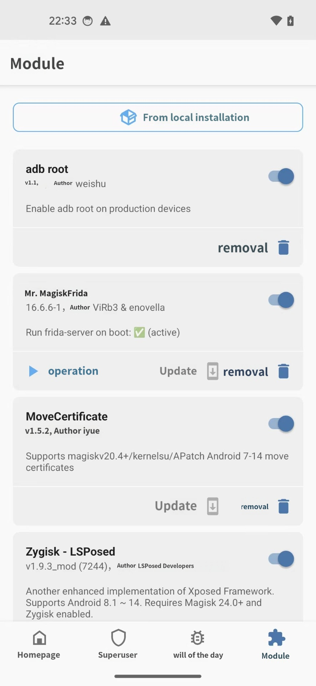

# Android: adbd cannot run as root in production builds

I have an Android-based phone (2.3.6) with unlocked root privileges. Since i'd like to have access to my phone through my computer, today i've installed QtAdb and Android SDK. If i open a command prompt and i do

> adb shell su

i get

> #

And so I am able to copy, remove, push files on my phone (on the phone i get a notification using the app "SuperSU".)

But if i launch QtAdb - under Windows 7 - i get the following error: "adbd cannot run as root in production builds". I miss something? There's something wrong with QtAdb?

## Solution #1

The problem is that, even though your phone is rooted, the 'adbd' server on the phone does not use root permissions. You can try to bypass these checks or install a different adbd on your phone or install a custom kernel/distribution that includes a patched adbd.

_Or_, a possibly easier solution if you can find a compatible version for your phone is to use 'adbd insecure' from chainfire which will patch your adbd on the fly. It's not permanent, so you have to run it before starting up the adb server (or else set it to run every boot). You can get the app from the google play store for a couple bucks:

[https://play.google.com/store/apps/details?id=eu.chainfire.adbd&hl=en](https://play.google.com/store/apps/details?id=eu.chainfire.adbd&hl=en)

(seems to be no longer available - but some apk archives may have it)

Or you can get it for free, the author has posted a free version on xda-developers:

[http://forum.xda-developers.com/showthread.php?t=1687590](http://forum.xda-developers.com/showthread.php?t=1687590)

(may not work on some newer Android devices)

Install it to your device (copy it to the device and open the apk file with a file manager), run `adb insecure` on the device, and finally kill the adb server on your computer:

```
% adb kill-server
```

And then restart the server and it should already be root.

## Solution #2

For those who rooted the Android device with Magisk, you can install adb\_root from [https://github.com/evdenis/adb\_root](https://github.com/evdenis/adb_root). Then `adb root` can run smoothly.

## Solution #3

## Issue

-   env
    -   Phone(`Android 14`, `Google Pixel 5`) + Mac
-   error
    -   Mac shell:

```shell
➜ adb root
adbd cannot run as root in production builds
```

## Solution #3

-   Steps
    1.  \[Already\] use [topjohnwu/Magisk](https://github.com/topjohnwu/Magisk) to got android **root**
    2.  install Magisk plugin [tiann/adb\_root](https://github.com/tiann/adb_root)
        -   which support `Android 11+`
        -   (after reboot phone) installed in Magisk:
            -   

## Note

-   for `< Android 11` phones, use [evdenis/adb\_root](https://github.com/evdenis/adb_root), may work, for it support `Android 9/10`


## References

- https://developer.android.com/tools/adb
- https://stackoverflow.com/questions/31374085/installing-adb-on-macos
- http://wiki.cacert.org/FAQ/ImportRootCert?action=show&redirect=ImportRootCert#Android_Phones
- https://stackoverflow.com/questions/25271878/android-adbd-cannot-run-as-root-in-production-builds
- https://android.stackexchange.com/questions/186630/android-o-failed-to-mount-system-dev-block-dm-0-is-read-only
- https://stackoverflow.com/questions/55030788/adb-remount-fails-mount-system-not-in-proc-mounts
- https://github.com/iGio90/Dwarf/issues/71
- 