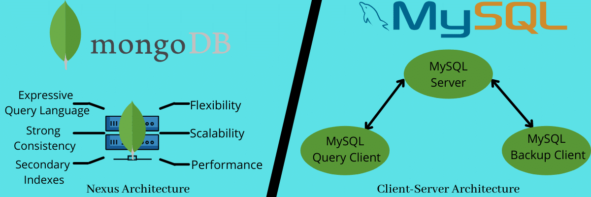
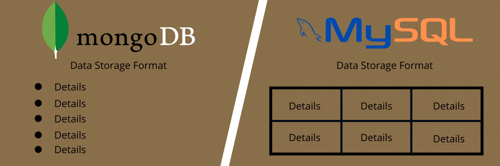
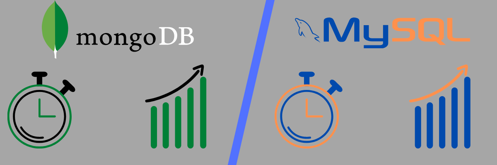
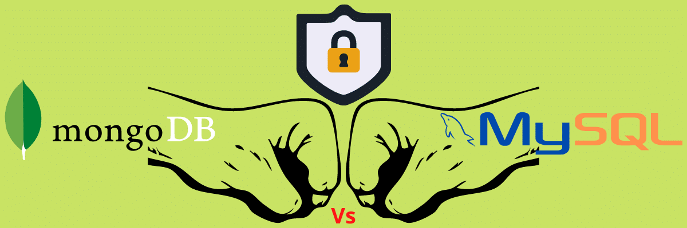
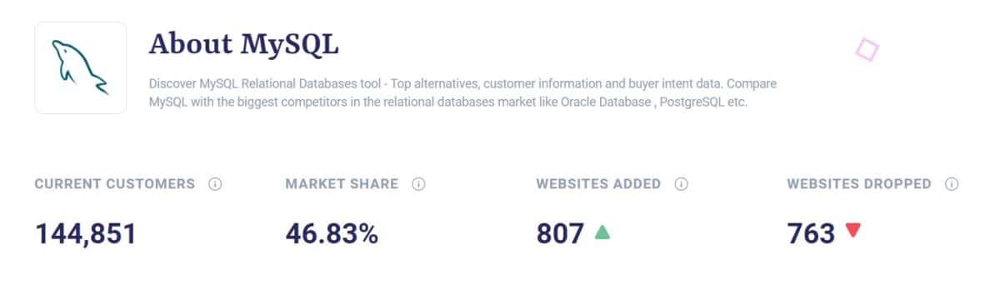
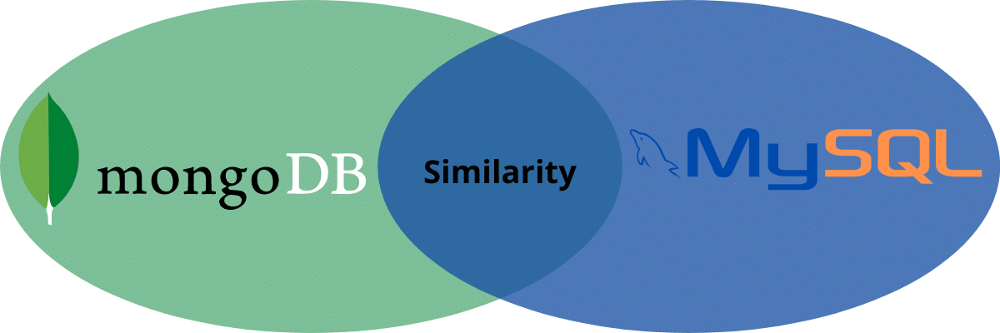

# MongoDB vs MySQL: Which Is the Better Database Management System?

With a variety of databases available in the market, users often get into a debate over MongoDB vs MySQL to suss out the better option.

Organizations that use a relational database like MySQL might face certain difficulties while managing and storing their data with the changing requirements. At the same time, new firms are wondering what database to choose so they don’t face issues in their development pipeline.

Meanwhile, developers building financial apps are also often confused about whether they should stick with the old standby MySQL or risk tasting another piece of the pie with MongoDB.

This is what brings us to this debate. Comparing MongoDB vs MySQL will help you understand the differences between the two databases, their pros and cons, and which is better for what purpose. In short, it will help you pick the right database for your projects.

So, welcome to the debate!

### Table of Contents

1.  [MongoDB vs MySQL: What Are They?](#mongodb-vs-mysql-what-are-they)
2.  [MongoDB vs MySQL DBMS Comparison](#mongodb-vs-mysql-dbms-comparison)
3.  [MongoDB vs MySQL: When to Use Them?](#mongodb-vs-mysql-when-to-use-them)
4.  [MongoDB vs MySQL: Advantages and Disadvantages](#mongodb-vs-mysql-advantages-and-disadvantages)
5.  [MongoDB vs MySQL: Editions and Pricing](#mongodb-vs-mysql-editions-and-pricing)
6.  [MongoDB vs MySQL: Key Similarities and Differences](#mongodb-vs-mysql-key-similarities-and-differences)
7.  [Can MongoDB Replace MySQL?](#can-mongodb-replace-mysql)

## MongoDB vs MySQL: What Are They?

Let’s quickly sketch out what MongoDB and MySQL each are before we start comparing them.

### What Is MongoDB?

[MongoDB](https://www.mongodb.com/) is a powerful open source and free-to-use non-relational database system popular for storing high volumes of data. It was released 12 years ago in 2009 by 10gen (now MongoDB Inc.) with a Server Side Public License. T a NoSQL database program written in C++, Python, and JavaScript with cross-platform compatibility. It supports operating systems, including Windows, macOS, and Linux, and languages like C, PHP, Java, Ruby, Node.js, and more.

MongoDB differs from traditional database systems in terms of how that data gets stored.

Instead of storing data in rows and columns, MongoDB takes a document-oriented design that represents data in various JSON-like documents and collections. These documents contain a series of value or key pairs of different types, such as nested documents and arrays. The key/value pairs can be structured differently from one document to another.

MongoDB offers greater security, reliability, and efficiency in addition to the flexibility of modifying the data structure or schema. As a result, it facilitates higher speed and storage requirements.

#### Features of MongoDB

Now, let’s move on to looking at some of the main features of MongoDB:

-   **Replication:** MongoDB allows you to make several copies of your data using replication (replica sets) and deploy them on various servers. This feature is helpful for data backups and disaster management. In case of a server failure, you can always retrieve your data from the copies stored in other servers.
-   **Indexing:** You can index fields in MongoDB documents as primary or secondary. This helps improve search performance in the database and lets you perform the search on indexes rather than the entire document, which automatically helps increase search speed.
-   **Ad-hoc queries:** Ad-hoc queries are temporary commands that provide different returns for executing queries. That said, MongoDB supports range query, regular expression (Regex), and field searches. Also, queries include JavaScript functions defined by users and can return specific document fields. You can update these ad-hoc queries in real time with the help of MongoDB Query Language (MQL), which is useful for real-time analytics for enterprises.

-   **Sharding:** MongoDB is capable of scaling horizontally with the help of sharding, a method of distributing large datasets across different data collections. Here, users can choose a shard key (a master key with single or multiple replicas) to determine the data distribution in a collection and split the data into different ranges across shards. Each shard functions as an individual database, forming one single database using other shards contributes to load balancing and executes complicated queries.

-   **Load balancing:** MongoDB facilitates control concurrency to handle multiple client requests simultaneously to various servers. This helps reduce the load on each server, ensures data uptime and consistency, and allows for scalable applications.
-   **File storage:** You can use MongoDB as a file system, known as GridFS, that comes with data replication and load balancing features for multiple computers to store files. GridFS, or grid file system, includes MongoDB drivers, and you can access it with Nginx and lighttpd plugins or the mongofiles utility. MongoDB also lets developers manipulate files and content.
-   **Aggregation:** Data aggregation allows users to get similar results to those obtained for the SQL clause `- GROUP BY`. MongoDB offers three aggregation ways:

1.  1.  **Aggregation pipeline:** This offers better aggregation performance than others for most operations.
    2.  **Single-purpose aggregation:** This is used to aggregate documents out of one collection.
    3.  **Map-reduce function:** This is used for batch data processing to bring aggregated results. The `map` function groups data by key-value, while the `reduce` function performs operations on it.

-   **Capped collections:** MongoDB supports capped collections, the collection type that handles data insertion order.

#### Uses of MongoDB

MongoDB is used in thousands of organizations worldwide for data storage or as their applications’ database service. It’s useful in:

-   Content management systems like WordPress to enter, store, and edit content
-   Data storage for web and mobile applications
-   Social networking websites
-   Maintaining geospatial or location-based data
-   Ecommerce product catalogs and asset management
-   Cloud-based systems
-   Moving workloads from the mainframe
-   Real-time analytics at high speed
-   Scalable and high-performance video games
-   Modernizing payment architecture and legacy modernization
-   Systems with evolving data storage needs, demand for faster logging and caching, and changing designs
-   MEAN technology stack for web development, where M stands for MongoDB, and the rest technologies are ExpressJS, AngularJS, and NodeJS, respectively.

Companies like Twitter, IBM, Oracle, Zendesk, Citrix, Sony, Intercom, HTC, and others are all using MongoDB. Here are some of the widely recognized use cases of MongoDB:

-   **Aadhar:** Aadhar is a Unique Identification project of India and the largest biometric database in the world. MongoDB is one of the databases it uses to store the biometric and demographic data of more than 1.2 billion people.
-   **eBay:** The American ecommerce company eBay, which functions as B2C and C2C, uses MongoDB in its various projects like search suggestions, cloud management, and metadata storage.
-   **Shutterfly:** Shutterfly is a popular photo-sharing platform that uses MongoDB to store and manage 6+ billion images, with 10k operations/second transaction capacity.

### What Is MySQL?

[MySQL](https://www.mysql.com/) is a free, open-source relational database management system (RDBMS). It organizes and stores data into a tabular format with rows and columns in which data types are related. It has a GNU General Public License, and you can find its repository on GitHub.

This database was created originally in 1995 by MySQL AB, a Swedish company whose founder was Swedes David Axmark, Finland Swede Michael Widenius, and Allan Larsson. However, Sun Microsystems bought MySQL AB, and in 2010, Oracle acquired Sun Microsystems.

MySQL’s nomenclature is also interesting — it combines two terms:

-   **My:** The name of Michael Widenius’s daughter.
-   **SQL:** Stands for Structural Query Language.

SQL is a domain-specific programming language that can manage data in an RDBMS by performing functions on data, including create, extract, delete, and modify.

MySQL works with many operating systems, such as Windows, macOS, Linux, FreeBSD, OpenBSD, and Solaris, to implement RDBMS in a device’s storage system, allow network access, manage users, facilitate database integrity testing, and create backups. It’s written in C++ and C and uses a lexical analyzer, while its SQL parser uses yacc.

This database has received positive feedback, especially for average usage with its easy-to-use interface. Performance-wise, it’s fast and stable, and it features a multithreading and multi-user database server.

MySQL is available in two editions: open-source "Community Edition Server" and proprietary "Enterprise Edition Server". The latter offers lots of server plugins to install with no change to the codebase.

#### Features of MySQL

Let’s talk more about the features of this popular RDBMS.

-   **Replication and clustering:** MySQL allows replication and clustering that help improve application scalability and performance via different synchronization types. You can also copy data from a SQL server to other replica SQL servers. This also lets you backup data in multiple databases to avoid data loss.
-   **Password support:** MySQL facilitates a password encryption system for host verification when someone tries accessing the database. It adds database security and ensures only authorized individuals have access. In addition, its latest release, MySQL 8.0, also offers support for a dual password, allowing developers to modify password credentials easily without downtime.

-   **Performance Schema:** It monitors application performance, resource utilization, and server events. This enables you to allocate resources appropriately, enhance app performance on detecting any slowdowns, and take necessary steps in case of any suspicious server events.
-   **Online schema:** MySQL supports multiple online schemas that help you meet your data storage requirements and offer more flexibility.
-   **Resilience:** MySQL-supported applications are resilient to failures and can cope up easily in such situations. As a result, it offers high data availability for all types of applications, web or mobile.
-   **Transaction support:** You get support for multi-level and distributed transactions, limitless row-level blocking, and ACID-compliant transactions. In the transaction processing context, there are four principles called ACID principles. It stands for Atomicity, Consistency, Isolation, and Durability. Additionally, it helps you maintain database snapshots and integrity with constraints such as multi-version concurrency control and foreign key implementation.

-   **GUI support:** There are plenty of GUI tools available in MySQL to ease the process of creating, designing, and administrating command-line tools for saving time convenience. Database architects, administrators, and developers can utilize these tools to streamline their work.
-   **Limitations:** Horizontal scaling is not easy; millions of read or write processes affect database performance and include other limitations shared by relational databases.

#### Uses of MySQL

MySQL has been around for over two decades and offered the convenience of storing a large number of data for organizations across the globe. Here are some of the uses of MySQL and who uses it.

-   Content Management Systems and blogs
-   Ecommerce applications with plenty of products
-   Logging applications
-   Data warehousing
-   For applications requiring high-end data security, social media sites like Facebook and Instagram
-   MySQL is used in storage engines like InnoDB, MyISAM, Memory, CSV, Merge, Archive, Blackhole, and Federated.
-   LAMP Stack is a technology stack for web development using MySQL as one of its components. It stands for Linux, Apache, MySQL, and PHP/Python/Perl.
-   It’s installed in various cloud platforms such as Microsoft Azure, Amazon EC2, Oracle Cloud, etc.

In fact, Oracle Cloud offers MySQL as a Service to allow users to install MySQL Server and deploy it in the cloud. This way, you don’t need to install it on your local servers.

Notable organizations using MySQL are Airbnb, NASA, Sony, YouTube, Netflix, Pinterest, Drupal, Joomla, and more. Here are some of the prominent MySQL use cases:

-   **Wikipedia:** Wikipedia is a free encyclopedia spreading knowledge across the globe. It uses MySQL and needs high scalability to meet the growing user base. The database helps them update their content, accommodate more content and visitors, and enable thousands of entries and edits.
-   **Twitter:** Twitter moved on from temporal sharding for tweet storage to a more distributed method using T-bird. And T-bird is built with Gizzard that uses MySQL.

Temporary sharding was expensive and needed more machines to fill up tweets. They also faced issues with load balancing and were logically complicated for DBA. MySQL supporting T-bird solves these problems.

That was all about MongoDB and MySQL to give you the context. Now, let’s finally compare MongoDB vs MySQL to help you decide what can be better suitable for your next software application.

## MongoDB vs MySQL DBMS Comparison

Here are some parameters based on which we will compare MongoDB vs MySQL.

### Architecture



MongoDB vs MySQL Architecture.

Architecture forms the basis of every system and establishes the framework where all the features and functionalities can be introduced. Hence, it’s important to compare the architecture of MongoDB vs MySQL and understand them closely to determine what will be the better choice for your application.

#### MongoDB

It has the Nexus Architecture as its design philosophy, which combines the functionalities of relational databases. It can meet the needs of modern applications by offering high scalability, global availability, and a flexible schema. Therefore, making changes in its design is rather easy.

In addition, MongoDB includes official drivers for leading development environments like AWS, Azure, and Kubernetes, programming languages like JavaScript, Python, etc., and frameworks like Django.

#### MySQL

MySQL, on the other hand, includes a client-server architecture with storage optimized to offer high performance and multithreading. Its documentation also showcases a few performance optimization techniques that deal with configuration instead of fine-tuning SQL measurements.

**Winner**: It’s a tie.

### Data Storage Format



MongoDB vs MySQL: Data Storage Format.

#### MongoDB

Data storage format in MongoDB can look like this:

```
{
Account Number: 1234567890
First Name: "Jon"
Last Name: "Doe"
Branch Name: "Los Angeles"
}
```

You can see that the format is JSON-like, and you can easily make changes to the data, meaning you can add more data, remove some information, and modify data without any hassle. The above example shows that there is no fixed schema for the database, introducing more flexibility.

#### MySQL

Data storage format in MySQL, on the other hand, looks something like this:

| Account Number | First Name | Last Name | Branch Name |
| --- | --- | --- | --- |
| 12345678901 | Jon | Doe | Los Angeles |
| 12345678902 | Jane | Doe | Seattle |

The above table shows how MySQL organizes data in the form of rows and columns. It has a proper, rigid structure that’s difficult to change compared to MongoDB. It’s because you cannot introduce a spate row or column; you need to make the design in such a way that for every row, there’s a column and vice versa; otherwise, it will violate the schema. But, in MongoDB, you can easily modify the data.

There is a slight variance in terminologies for MongoDB vs MySQL:

| MongoDB | MySQL |
| --- | --- |
| Collection | Table |
| Document | Row |
| Field | Column |
| Linking and embedding | Joining |
| Sharding | Partition |
| RepISet | Replication |

**Winner**: MongoDB’s data storage format is easier to modify.

### Schema Flexibility

The database you choose must offer the flexibility of modifying your database’s design or schema based on varying needs. Otherwise, it becomes really annoying when there’s even a slight change in the requirements.

So, let’s find out MongoDB vs MySQL based on how flexible their schemas are.

#### MongoDB

MySQL provides a flexible schema to enable users to change the design based on requirements, especially for Big Data applications. It lets you combine and store different types of data easily and modify the schema dynamically without downtime. You can store multiple documents in a collection even without any relation between them, as it’s a non-relational database system. It uses JSON-like documents having optional schemas.

However, it lacks transactions and joins; so, you need frequent schema optimization depending upon how the app accesses data.

#### MySQL

In MySQL, you must clearly define columns and tables before storing data along with rows and columns. Here, every field comprises a row and column. This means data storage does not give you much flexibility like in MongoDB. It also means a slower deployment and development process.

But if you have a fixed schema for your applications, MySQL is best. It will offer better data consistency without changing the design time and again or wasting time on it. But again, if you have changing needs, MongoDB can be a better option for you.

**Winner**: Clearly, MongoDB offers more schema flexibility.

### Query Language Used

Knowing which database uses what query language is vital. It will help you understand which one can be handier for you, instead of getting confused after installing it.

#### MongoDB

MongoDB utilizes MongoDB Query Language (MQL) instead of SQL. It’s expressive and rich and supports CRUD functions, which lets you create, read, update, and delete data. In addition, it also facilitates data aggregation, geospatial queries, and text search.

If you want to request data, you must define documents with matching properties as that of the expected results. It means that you need to perform query operations to fetch data from the database, like **db.collection.find()**. MongoDB executes queries typically using operators linked using JSON. In addition, it supports OR and Boolean AND queries.

However, MongoDB never uses join operations, and it does have any other equivalent operator.

#### MySQL

On the other hand, MySQL uses SQL like other relational databases. It can bring data from different tables by supporting the join functionality. This is what makes a relational database like MySQL “relational.” This operation lets you link data from multiple tables in a query.

That said, SQL has a:

-   Data Definition Language (DDL) to create, drop, and alter tables
-   Data Transaction Language (DTL) with operations like commit and rollback
-   Data Manipulation Language (DML) with options like insert, delete, and update rows
-   Data Control Language (DCL) with revoke and grant commands

**Winner**: It’s a tie.

### Performance and Speed



MongoDB vs MySQL: Performance and Speed.

Performance and speed are something you can never ignore while choosing a database. You must know what to expect with which database and for what purposes. And for busy professionals like developers and administrators, every second is essential.

Therefore, you must choose a database that can offer better performance to support your productivity and not the other way around. So, let’s compare their speed and performance.

Since both MongoDB and MySQL have different data storage approaches, it’s a bit difficult to assess their performance. You can compare two SQL databases against some standard benchmarks, but it’s hard to do the same with non-relational databases.

But we are going to compare MongoDB vs MySQL based on common operations and how they perform under higher volumes of data.

#### MongoDB

As MongoDB stores a large volume of unstructured data and follows a document-based storage approach, it’s relatively faster than MySQL. It means MongoDB stores data in a single document for an entity and helps in faster data read or write. Features like replication can be a big reason for this. Its performance is also better when it works with objects because of its Jason-like object storage.

In addition, MongoDB never involves vendor lock-in, giving you the freedom to improve the performance using alternatives if you are not satisfied with one service.

#### MySQL

MySQL can exhibit slow performance while dealing with a huge volume of data. It’s because it stores tables in a normalized fashion. And if you want to change data or extract it, you need to go through lots of tables to write and read data, which increases server loads and affects its performance. But you can go for MySQL for transactional operations.

It requires a definite data structure to be able to add data into the database. Hence, it’s not suitable if you want to store unstructured data. And sometimes, it also becomes hard to design an appropriate schema when it comes to complex data.

**Winner**: MongoDB is faster and better performing.

### Security



MongoDB vs MySQL: Security.

Security is always one of the main criteria when comparing two systems, given the increasing cyberattack incidents across the world. Hence, it’s important to compare MongoDB vs MySQL to determine which one of them is more secure for your applications.

#### MongoDB

MongoDB leverages role-based access controls with flexible permissions for users and devices. Every user is given a role based on which they are given specific permissions to access data and perform operations. For example, users like senior-level employees would have higher clearance levels, so their privileges would be more substantial.

This is one way of providing security to your database so that no unauthorized users or attacks can access your database and exploit it. In addition, MongoDB also facilitates Transport Layer Security (TLS) encryption and a security protocol called Secure Sockets Layer (SSL) for added security. You can also write encrypted documents into data collections with a master key to achieve data encryption at rest.

#### MySQL

On the other hand, MySQL has privilege-based access controls. It also supports encryption facilities like MongoDB with a similar authentication model, including authorization, authentication, and auditing. You can grant roles and privileges to users, enabling them to access permissions for data sets and operations. In addition, you can also apply for TLS and SSL for more security.

In its recent update, MySQL has also included dual password support to ensure more security for data access.

Although both seem to give each other a neck-to-neck competition when it comes to security, MySQL is considered more secure. The reason lies in its rigid architecture and schema, which offers better data consistency and reliability.

**Winner**: MySQL is more secure (being rigid is not also bad).

### Scalability


MongoDB vs MySQL: Scalability.

As your application grows with an increased user base and traffic, you must be able to scale it smoothly to meet changing demands. And if your application does not scale, customers can have a bad experience using it with frequent crashes, lags, and downtimes. And nobody likes using such systems, and they can jump to other alternatives, if not now, then sooner.

Hence, it’s important to take care of application scalability, and the database you choose can affect scalability. So, let’s compare MongoDB vs MySQL based on how much scalability they provide.

#### MongoDB

MongoDB is extremely scalable, which is one of the top reasons it’s used in growing websites, CMS systems, and ecommerce stores. It can scale horizontally using a process called sharding. A shard is a part of a database, and sharding is a data distribution technique across multiple collections and machines. It enables you to deploy systems with higher throughput operations and large data sets.

With higher scalability, you can easily create multiple server clusters by adding more and more servers into your database based on your requirements. It allows you to store a replica of your data sets in a sharded cluster with higher write and read performance to support applications of different scales. It also lets you ensure your data is backed up and never lose it in case of cyber attacks or disasters.

Not to mention, dividing load and datasets into different servers also lets you run them at a lower cost compared to one single server with all the data that requires high-end, expensive hardware. Another benefit of sharding in MongoDB is that it maximizes your disc space and offers dynamic load balancing.

Furthermore, MongoDB supports range-based sharding or data partitioning, along with transparent routing of queries and distributing data volume automatically.

#### MySQL

Coming to MySQL, scalability is limited. It gives you two choices for scaling your application — creating read replicas or vertical scaling. It allows data replication and vertical scaling through clustering to help improve application scalability and performance via different synchronization types.

The notable difference here is that MySQL offers vertical scaling, while MongoDB offers horizontal scaling with more flexibility. Now, vertical scaling means the system lets you increase the load by increasing CPU or RAM specifications in just a single server with an upper limit.

If you want to perform replication, it’s easy with read replications. This allows you to create read-only copies of your database and add them to different servers, but with limitations — one being on the total number of replicas you can add. As a result of this limitation, you may face issues concerning apps that read and write regularly for your databases (or are write-heavy).

Although multi-main replication is introduced in MySQL, its implementation is still limited compared to the functionalities you get in MongoDB. It can add more write scale, but for separate apps only; each one of them could write to various mains and get the scale.

Moreover, MySQL involves no standard implementation for sharding. Even though it offers two sharding methods — MySQL Fabric (sharding framework) and Automatic sharding — people rarely deploy them due to the many roadblocks and limitations. This is why companies like Facebook use a sharding framework of their own.

If you leverage sharding for scalability, make sure to choose the right sharding key as the wrong key can cause system inflexibility. For example, changing the sharding key may have an adverse effect on an application, nodal transactions, and location. Also, issues like data consistency may surface if shard changes are incomplete.

Thus, when using MySQL, you must carefully make the right decisions for schema changes and mapping between data partitions, sharding keys, nodes, and databases.

**Winner**: MongoDB offers higher scalability, whereas MySQL has lots of limitations and can bring inconsistencies and issues if certain processes are not done right, as explained before.

### Transaction Model: ACID vs BASE

One of the important steps while choosing a database is to find out its transaction model. The transaction model consists of rules to determine how a database stores, manipulates and organizes data.

Two transaction models are popular:

-   ACID (Atomic, Consistent, Isolated, and Durable)
-   BASE (Basic Availability, Soft State, and Eventual consistency)

According to the CAP (Consistency, Availability, and Partition) theorem, it’s impossible to have both availability and consistency in a partition-tolerant distributed system or the system that continues working even during temporary communication breaks.

The difference between a database with ACID and BASE models is how they handle this limitation. An ACID database offers a more consistent system, while a BASE database offers higher availability.

Now, let’s find out what models MongoDB and MySQL follow.

#### MongoDB

MongoDB follows the BASE model and ensures that a transaction is always available. Here’s how it works:

-   **Basically Available:** The database with the BASE model ensures data availability by replicating and spreading data across different nodes present in the database cluster instead of enforcing instantaneous consistency.
-   **Soft State:** Data values in the BASE model can change over time as there’s no immediate consistency. The model can also break off with a database concept enforcing its consistency and delegates this responsibility to your developers.
-   **Eventually Consistent:** Although BASE doesn’t enforce immediate consistency, it can. And when it does, you can still perform data read.

The BASE model adopted by databases other than MongoDB includes Redis and Cassandra. This model is an excellent choice if you need sentiment analysis in your application.

Customer service and marketing companies can leverage this to conduct their social network research. The database can also accommodate the large volume of data in social networking feeds.

#### MySQL

MySQL follows the ACID model to ensure consistency for every transaction. It’s suitable for businesses dealing with online analytical processing like data warehousing or online transaction processing like finance institutions. Such organizations require a database that can manage small simultaneous transactions of any size. Here’s how ACID works:

-   **Atomic:** Every transaction in the ACID model is either carried out properly or halted altogether, while the database reverts to the initial state of the transaction. This is done to ensure the data is valid across the database.
-   **Consistent:** Transactions are consistent and never harms the database’s structural integrity.
-   **Isolated:** This property ensures that no transaction can interfere with other transactions while in the process to compromise their integrity in the database.
-   **Durable:** Data relating to a completed transaction can persist during a power or network outage. Even if a transaction fails, no data will be impacted.

As it offers higher security and transaction guarantee, financial institutions utilize ACID databases exclusively. Its atomic nature also facilitates secure money transfers. It ensures that interrupted transactions are terminated immediately to prevent errors.

Acid compliant relational databases other than MySQL are PostgreSQL, SQLite, Oracle, etc. In addition, some non-relational databases also are ACID compliant to a certain degree, such as Apache CouchDB and IBM Db2.

The question is which transaction model is better, and the answer is unclear because both are useful for different use cases and project aspects. ACID databases can suit projects requiring more consistency, reliability, and predictability due to their structured nature.

On the other hand, the BASE database is more suitable for projects requiring higher and easier scaling with more flexibility.

**Winner**: It’s a tie.

### Ease of Use


MongoDB vs MySQL: Ease of Use.

When choosing a database, you must keep in mind how easy the database is to use. It shouldn’t ever give your team a hard time, else productivity will decrease, and you’ll have to spend resources and time training them.

So, let’s find out which database — MongoDB vs MySQL — is easier to use.

#### MongoDB

MongoDB’s data storage process is quite simple, and anyone with programming skills can understand it. It stores data in an unstructured format in collections to give more flexibility. It allows developers who might or might not be experts in databases to use it to support their application development.

With varying schemas, MongoDB has a flexible interface for those teams who don’t need the features that a relational database like MySQL offers. For example, developers building a web app that doesn’t depend upon structured schema can use MongoDB.

However, not all people in your team need to be familiar with NoSQL databases like MongoDB. In that case, you will need to help them understand it if you want to go ahead with this database. In addition, certain queries are completely different from SQL databases, such as update, insert, delete, etc.

#### MySQL

MySQL has a designed structure, which anyone with basic programming skills can easily understand. Learning and using MySQL is easy, which is why when it comes to databases, people start with MySQL or any other SQL database for that matter.

Even if your developers are not skilled in MySQL but have experience with other SQL databases, they are likely to catch up quickly.

In addition, queries like select, join, etc., are effortless to execute in SQL-based databases like MySQL, SQLite, Oracle, PostgreSQL, etc.

Developers creating apps that need rigid and complex data structure and schemas with a larger number of tables will find it easy to work with MySQL. It’s also easier to use for developing an application that needs top-notch security or involves frequent transactions.

For example, banking applications can leverage MySQL to store large datasets that are critical with sensitive information. They need high-class security, transactional guarantee, and integrity.

**Winner**: Comparing MongoDB vs MySQL, MySQL is easier to use because of its simplicity and proper structure.

### Full-text Search Availability

#### MongoDB

This database has recently added a full-text search, and it’s executed with a specific index type on an array of strings. In addition, MongoDB supports term search and phase search to make it easy for users of any skill level to find things.

Furthermore, MongoDB supports Boolean search as well using both phrase and term search. Despite having certain limitations, you can still execute this feature quite easily. To perform full-text searches, the database doesn’t facilitate control over defining subset fields. It matches every field included consistently to show you the result.

#### MySQL

MySQL has been supporting full-text search for quite a long time now. It’s also executed using a special index type and facilitated with the help of phrase search, terms search, and Boolean search.

But when it comes to clustered databases, MySQL doesn’t support full-text indexing yet. So, it can be considered a limitation here.

**Winner**: MongoDB’s full-text is easier with little limitation.

### Data Replication

Data replication is an important part of a database. It means there is a provision to make copies of your data and store it in other database servers. It not only improves app scalability and performance but also lets you backup the data to avoid losing it. In addition, it increases efficiency while accessing data.

Let’s compare MongoDB vs MySQL based on how well they offer replication.

#### MongoDB

The only type of replication MongoDB supports is main-secondary data replication, where each data consists of a single main server. This configuration allows a large number of nodes (non-main or -secondary nodes) and restricts operations to carry out in a single database.

The single main accepts both writes and reads, and the configuration may also include read-only secondaries or servers. Here, data replicates asynchronously from the main to secondary. This type of replication is usually faster but not much reliable.

Main-secondary replication in MongoDB preceded the data replica sets but can offer less redundancy. MongoDB provides an option to convert main-secondary configuration into replica sets. Using replica sets, it can create different copies of data, and each member in the replica set is assigned a role, either primary or secondary, throughout the process.

Furthermore, read or write takes place on the primary replica by default, and then you can replicate it on a secondary replica. In addition, replica sets are more robust and suitable for production usage.

#### MySQL

Unlike MongoDB that supports a single replication method, MySQL offers two types of replication methods — main-main replication and main-secondary replication. With multi-source replication, you can easily replicate data in parallel from different mains.

Main-main replication works similar to main-secondary but is different in light of the fact that both nodes are replicas and mains simultaneously. This means circular replication exists between nodes. Here, you can have multiple main nodes to accept the write and read requests. You can also get multiple secondaries for each main. Besides, the replication is asynchronous between the mains.

The advantage of using a main-main database is that you can distribute mains across the entire network on several sites. Main-main configuration is considered more suitable for modern usage as each unit has a complete set of data. So, even if one of them fails, others are there to serve. The downside is, it can involve communication latency.

Apart from this, MySQL can also use other replication models like multi-main cluster and group replication.

**Winner**: Clearly, MySQL offers more options for replication with reliability compared to MongoDB.

### Index Optimization

Indexing helps you find data quickly in a database. Although index optimization is a common feature to both MongoDB and MySQL, they have different approaches. Hence, it’s important to understand what approach is better to give you more convenience.

So, let’s compare MongoDB vs MySQL based on how they perform index optimization.

#### MongoDB

If you are not able to find an index, you will need to scan each document in a collection to select the document offering a match for your query statement. This process is tedious and time-consuming. In addition, it needs more effort as there is no specific structure in which the data gets stored.

#### MySQL

If the index is not defined, the database search engine starts scanning the entire table to find the relevant row. As it’s a relational database with a proper structure, search query performs optimally and gives you faster results than MongoDB.

**Winner**: MySQL offers faster index optimization.

### Native Language Drivers

#### MongoDB

There are fewer limitations available in MongoDB for developers. MongoDB drivers and APIs must be native to the programming language used.

#### MySQL

MySQL offers limited options to developers for interacting with JSON data as there are multiple SQL functionality layers. It also comes with lots of limitations, which can become a huge overhead and needs better planning and execution. The developers who want to interact via idiomatic APIs also face lots of difficulties.

**Winner**: MongoDB is the clear winner here.

### Community Support and Deployments

Whether you are a beginner or expert user, you can run into trouble at any time. When this happens, you can take the help of your database’s developer community. They can answer your questions, help you learn more, and provide the opportunity to contribute to the community.

Similarly, you must also know which database can run on what platforms. It will help you decide what database to choose based on your project requirements and other technologies used.

So, let’s compare MongoDB vs MySQL based on their community support and deployments.

#### MongoDB

MongoDB Inc. owns and maintains MongoDB. As there is a surge in the users of NoSQL, this is one of the databases in this category. Due to its impeccable features and open-source availability, it has a strong community that you can count on.

Talking about deployment, MongoDB is easy to use and deploy across various platforms, including Windows, Linux, macOS, FreeBSD, and Solaris, and is available for web, cloud, and SaaS applications.

#### MySQL

Oracle Corporation currently owns and maintains MySQL, which was initially under Sun Microsystems and MySQL AB before that. As it’s been around for 20+ years, it has a widespread user base globally. As a result, its community support is also excellent. You can connect, learn, and grow your database knowledge by becoming a part of this big community.

For deployment, MySQL is also effortless. You can even build and install it manually using the source code that you can find on GitHub. Or, you can install it from a binary package if no special customization is needed.

MySQL is available for web, cloud, and SaaS applications like MongoDB and runs on multiple platforms, such as Windows, macOS, Linux, Solaris, and FreeBSD. It can also run on cloud platforms like Microsoft Azure, Oracle Cloud, and Amazon EC2. You can use the package manager to download MySQL and install it with ease for many Linux distributions. Next, you may require to configure optimization and security settings on it.

**Winner**: Given the wide community base and ease of using and deployment, MySQL scores over MongoDB.

MongoDB and MySQL are both big names in the database industry. So, it’s time we find which is more popular and why along with their market share across the globe.

#### MongoDB

MongoDB is the most popular non-relational database and received well in the overall database market.

According to Datanyze, [MongoDB ranks 7th in databases](https://www.datanyze.com/market-share/databases--272/mongodb-market-share) with a market share of 4.5%. It also highlights that over 7k companies across the world use MongoDB.


MongoDB Market Share.

The reason behind its popularity is the flexibility and scalability for an application that developers need to meet the growing user demands at present. It also empowers users to manipulate data, query with ease, and find useful insights.

In addition, MongoDB has over 177k repositories, and 923k+ commits on GitHub.

#### MySQL

MySQL is one of the most popular databases in the world. People use it as a standalone system or combine it with others like [MongoDB, PostgreSQL](https://kinsta.com/blog/mongodb-vs-postgresql/), etc.

[According to a Statista report](https://www.statista.com/statistics/809750/worldwide-popularity-ranking-database-management-systems/), as of June 2021, MySQL is the second most popular DBMS globally after Oracle. The reason can be so many; it’s free, open-source, and comes with great features. It offers scalability, availability, and security to make it suitable for modern-day projects. In addition, its massive online community and ease of use attract a lot of users.

Another report reveals the [market share of MySQL](https://www.slintel.com/tech/relational-databases/mysql-market-share) to be around 46.83%, with 144k+ active customers.



MySQL Market Share.

In addition, MySQL has 222k+ repositories and over 7 million commits on GitHub.

**Winner**: MySQL is, no doubt, more popular among the two.

## MongoDB vs MySQL: When to Use Them?

MongoDB and MySQL both have their pros and cons, strengths and weaknesses. Therefore, they are useful across different cases.

#### MongoDB

This database is useful if you want to have higher data availability in addition to faster, automatic, and quick data recovery. As it offers excellent scalability, you can consider MongoDB if you are developing an application or site with growing needs.

For small firms with no database, an administrator can make the most out of MongoDB. However, this should not be a permanent solution if you are aiming for growth. Also, if you want to cut down your cost associated with schema migration, MongoDB can be a viable option.

Furthermore, MongoDB can be suitable for you if most services you run are on the cloud. It has a native architecture with scalability features like sharding to meet horizontal scaling and business agility that you wish for.

#### MySQL

MySQL is the better choice for an early-stage start-up with no immediate need to scale. Additionally, if you are working on a project that would not need much scaling in the future, you can consider MySQL. It will also provide easy setup and maintenance.

Apart from this, you can consider MySQL if you wish to keep a fixed schema with structured data that does not require you to change with time. Also, if you have a limited budget and still need high performance, MySQL is the one.

Moreover, if you are building a finance application or a project with higher transaction rates, MySQL is a good option. Its security features also provide your application and data safety from falling into the wrong hands or being stolen in a cyberattack.

**Winner**: As both are useful for different types of businesses, there’s no clear winner here.

## MongoDB vs MySQL: Advantages and Disadvantages

Look at various advantages and disadvantages associated with MongoDB and MySQL:

#### MongoDB

The advantages of MongoDB are:

-   It’s highly adaptable and flexible to meet changing business requirements and situations.
-   Effortless to scale up or down
-   Allows for queries and return fields within a document
-   Supports data replication so you can preserve copies of your data and never lose them
-   Allows for storage of different types of files of different sizes without affecting your tech stack
-   Allows for creation of indexes to enhance search performance
-   Runs on multiple servers and offers data duplication and load balancing, so it works even during a hardware failure
-   Follows the BASE model to offer higher data availability
-   Easy to use

The disadvantages of MongoDB are:

-   ACID model is not strong compared to other database systems
-   Provides no option for Stored Procedures, meaning you won’t be able to implement your business logic at its database level, unlike relational databases
-   Transactions can sometimes be complex or insecure
-   Somewhat steep learning curve
-   Documentation is poorly structured
-   Involves higher memory consumption and lacks joins or built-in analytics

#### MySQL

MySQL offers the following advantages:

-   Supports multiple replication options like main-secondary, main-main, scale-out, group replication, etc.
-   Effortless to use and install with a user-friendly interface. In addition, you can learn it easily and troubleshoot it using different sources such as useful books, white papers, and blogs.
-   Can manage a large volume of data, from storage to performing operations on it
-   Offers less overhead associated with its storage engine
-   More secure and uses privilege-based authentication
-   Offers features like global data distribution and reporting, which make it useful for applications of different shapes and sizes
-   Supports a memory storage engine to find tables frequently in use

The disadvantages of using MySQL are:

-   No caching of stored procedures
-   Transactions with system catalogs aren’t ACID compliant
-   MySQL tables for triggers or procedures are mostly pre-locked
-   System crashes can corrupt the entire system catalog
-   Relies heavily on SQL
-   Supports no Python or Java integrations

**Winner**: No clear winner, as both MySQL and MongoDB have some advantages and disadvantages.

## MongoDB vs MySQL: Editions and Pricing

Although MongoDB and MySQL are open-source and free to use, they also offer paid editions to offer more features and benefits.

#### MongoDB

MongoDB offers various plans, free and paid. You can use its free edition for small-scale apps deployed on a shared cloud. Here are its three editions:

-   **MongoDB Community Server:** It’s free and runs on Windows, OS X, and Linux.
-   **MongoDB Enterprise Server:** It is for commercial use.
-   **MongoDB Atlas:** It is a fully managed, on-demand cloud database that runs on GCP, Azure, and AWS.

So, if you have a diverse requirement, you can choose a pricing tier based on the types of cloud, security standards, and storage. It includes three pricing plans:

-   **Shared**: $0/month
-   **Dedicated**: Available at $57/month
-   **Serverless**: From $0.30 per million reads

#### MySQL

Apart from the free edition, MySQL has these commercial plans:

-   **MySQL Standard Edition:** Available at $2,000/annum
-   **MySQL Enterprise Edition:** Available at $5000/annum
-   **MySQL Cluster CGE:** Available at $10,000/annum

**Winner**: It’s a tie, comparing the pricing and benefits.

## MongoDB vs MySQL: Key Similarities and Differences



Similarities between MongoDB and MySQL.

The main similarities between MongoDB and MySQL are as follows:

### Similarities

MongoDB and MySQL both:

-   Are open sources and free databases.
-   Use a powerful query language.
-   Support full-text search using phrase and term search.
-   Offer index searching with the help of phrase search and text search.
-   Have strong community support with thousands of professionals
-   Offer index optimization
-   Offer data replication through main-secondary configuration.

### Differences

Let’s take a look at the differences between MongoDB and MySQL in an easy-to-ingest table:

| Parameter | MongoDB | MySQL |
| --- | --- | --- |
| Type of database | It’s an open source, non-relational (NoSQL) database system developed by MongoDB Inc. | It’s an open source, relational database management system (RDBMS) developed by MySQL AB and currently owned by Oracle. |
| Database structure | It stores data in JSON-like documents and collections. The schema can vary, and it’s easy to make modifications | It stores data in a tabular structure with rows and columns. |
| Architecture | It follows the Nexus Architecture with higher flexibility and availability. | It follows the client-server architecture with optimized storage performance and multithreading. |
| Schema Flexibility | Highly flexible schema to allow easy design modification without downtimes. | Its schema is rigid, so making modifications is not easy. |
| Query language | It uses MongoDB Query Language (MQL), which is rich, expressive with CRUD functions. | It uses SQL and fetches data from other tables using the join functionality. |
| Performance and speed | T faster than MySQL and facilitates quick read and write requests. | It’s relatively slower than MongoDB while handling large data volumes as it stores data in a tabular format. |
| Security | As there is no fixed structure, inconsistencies and data security issues may surface. | MySQL offers better security as it has defined data structures with higher consistencies. |
| Native Language Drivers | It offers fewer limitations for developers and supports native MongoDB drivers and APIs like that of the programming language used. | It has limited options for interacting with JSON due to various SQL functionality layers. |
| Scalability | It’s highly scalable and offers horizontal scaling through sharding. | Its scalability is limited, and you have the option to scale using read replicas or vertical scaling. |
| Transaction Model | MongoDB follows the BASE model with higher availability. | It follows the ACID model with more consistency. |
| Ease of use | Using MongoDB is simple and easy. | MySQL is easier to use for everyone with a defined, easy-to-understand structure. |
| Terminologies | Collection, field, document, linking, and embedded document | Table, column, row, and joins |

## Can MongoDB Replace MySQL?

The answer to the above question is: “Maybe!”

While replacing MySQL with MongoDB can be a wise decision for certain use cases and situations, it won’t work for others. Due to MongoDB’s exceptional flexibility, scalability, and lots of useful features, it performs faster.

Globally recognized companies such as eBay and Twitter are using this database to meet their data storage and management requirements. So, you can replace MySQL if you face issues like:

-   Large data; as MySQL can show issues while processing large-sized data with no proper schema
-   Complex data that you are not able to shape into a database
-   If you want to scale up and ease data partition
-   Replace with MongoDB if you have heavy data with low business value and deploy it in an open source model.

However, you may consider not replacing MySQL with MongoDB if you want to build a secure application like a financial or banking application. Also, if you want to build applications for marketing or analytics, then MySQL is better amongst other use cases.

## Summary

MongoDB and MySQL have different architecture and features that are suitable for different use cases. They have their advantages and disadvantages, explaining which one is suitable for what purpose.

Hence, there’s no one-size-fits-for-all policy here. In this MongoDB vs MySQL comparison, we cannot say one of them is superior. It’s not because this match was a draw, but due to their applicability in a variety of different tasks.

As flexibility and scalability are strong attributes of MongoDB, it’s suitable for apps with changing requirements and main for growth. On the other hand, MySQL’s strong points are security and consistency; for that reason, it’s more suitable for apps involving transactions, financial-based apps, etc., and those that don’t need frequent changes.

So before you choose one among MongoDB vs MySQL, make sure to identify your needs and priorities for your project, then choose the one that will better suit your requirements.

## References

- https://kinsta.com/blog/mongodb-vs-mysql/
