# Diving Deeper into Docker Networking with Docker Compose

In this new article, we’ll dive into the workings of Docker networking and gain a better understanding of how it operates.

## Network Modes

In Docker, We have several Docker network types available:

1.  **Bridge :** The default type of network in Docker. It provides isolation between containers, but also allows containers to communicate with each other.
2.  **Host :** A special type of network that allows containers to connect directly to the host machine’s network stack.
3.  **Overlay :** A more complex type of network that allows containers to communicate with each other even if they are not running on the same host machine.
4.  **Macvlan:** This network allows you to specify a MAC address for the container, allowing the container to be a physical device in the network.
5.  **Network plugins:** You can install and use third-party network plugins.
6.  **None:** This won’t create any new network environment. If the none driver is used, the container can only use the local network (Your computer network).

In this article, I’m planning to cover the Bridge and the Host Network modes.

## The Default Bridge Network

When you install Docker on your local computer, it will create a new network called **Docker Bridge**. You can check this by running the following command in your terminal.

In Linux Terminal:

```shell
ip address ls
```

You’ll see the `**docker0**`network interface there.

Additionally, you can run the following Docker command to list all the Docker networks available on your computer. (Windows & Linux)

```shell
docker network ls
```

You will get an output like the one below.

If you’ve worked with Docker for some time, it might show you some additional networks alongside it. We’ll discuss those in more detail later in this article.

```shell
NETWORK ID          NAME                DRIVER              SCOPE
17c1d0d4956b        bridge              bridge              local
f04d3c0691be        host                host                local
cea56a468e79        none                null                local
```

In simple terms, the above output tells us about a connection between two entities known as a **“bridge network”** and a **“bridge driver.”** It’s essential to understand that the network and the driver are linked, but they are not same components. The output also indicates that the **bridge network** has a local scope, meaning it exists only on this Docker host.

All the bridge networks offer a **single host network**, It means that the network is limited to enabling communication and connectivity among containers running on the same host. It does not extend to other hosts or computers in the network. This approach provides isolation and enhances security for the containers, allowing them to interact exclusively within the confines of the same system.

However, containers running on different hosts cannot directly communicate with each other using the bridge network. For **multi-host communication**, Docker offers alternative network drivers, such as **overlay networks**. These overlay networks enable containers across multiple hosts to communicate with each other over a distributed network, facilitating seamless communication in a clustered and distributed Docker environment.

Now, let’s see how this behavior works by doing a simple tutorial.

## Docker Compose: Default Bridge Network Tutorial

## Prerequisites

I hope you’ve installed docker in your computer. If not follow the official documentation. [https://docs.docker.com/engine/install/](https://docs.docker.com/engine/install/)

**In this article, I will frequently refer to the following terms:**

1.  **Mars:** Planet in our solar system, used for a network name.
2.  **Phobos:** One of the moons of Mars, used as a network node (container service).
3.  **Deimos:** Another moon of Mars, used as a network node (container service).
4.  **Earth:** Our planet, used for a network name.
5.  **Moon:** Our moon, used as a network node (container service).

First, we need to have a `docker-compose.yaml` file to get started.  
In this tutorial, we will create the following "**Mars**" network by the end of the process.

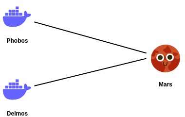

Mars Network

1.  First, Create a new project folder in your local computer.
2.  Within the project folder, create a new file named `docker-compose.yaml`.
3.  Now, copy and paste the following code snippet into your `docker-compose.yaml` file

[**docker-compose.yaml**](docker-compose.section-01.yml)

```yaml
version: "3"
services:
  phobos:
    container_name: phobos
    image: busybox
    command: sleep infinity
  deimos:
    container_name: deimos
    image: busybox
    command: sleep infinity
```

We will use [‘Busybox’](https://hub.docker.com/_/busybox) docker image in this tutorial. It’s a linux docker image coming in somewhere between 1 and 5 Mb in on-disk size. It’s small and it contains ‘iputils-ping’ package. Simply, It comes with the `ping` command.

With the `ping` command, you can determine whether a remote destination IP is active or inactive. You can also find the round-trip delay in communicating with the destination and check whether there is a packet loss. Basically, You can check the connectivity between two destinations (computers/ nodes).

## Let’s see what’s inside our `docker-compose.yaml` file.

`**version: "3"**`: This line specifies the version of the Docker Compose file format being used, which is version 3 in this case.

`**services**`: This section defines the individual services that make up the application.

`**phobos**`: This is the name of the first service, which corresponds to a container named "phobos". _Phobos is one of moons of the Mars._

`**container_name: phobos**`: This specifies the name of the Docker container that will be created for the "phobos" service. The container's name will be "phobos".

`**image: busybox**`: This line indicates that the "phobos" service will use the "busybox" image as its base image. BusyBox is a lightweight and minimal container image often used for debugging purposes or as a base image for other containers.

`**command: sleep infinity**`: This command is executed when the "phobos" container starts. In this case, the command is "sleep infinity", which means the container will do nothing and remain running indefinitely, essentially acting as a background process.

-   **deimos** service is also as same as the the phobos.

Now Let’s open the terminal in the project directory and execute the `docker compose up -d`command to **build** and **run** the both services.

```shell
docker compose up -d
```

We add `-d` at the end of the command to run all the containers in detach mode. You can check the running containers by using the `docker-compose ps` command.

```shell
$ docker compose ps
NAME                IMAGE               COMMAND             SERVICE             CREATED             STATUS              PORTS
deimos              busybox             "sleep infinity"    deimos              17 hours ago        Up 17 hours         
phobos              busybox             "sleep infinity"    phobos              17 hours ago        Up 17 hours         
```

Now you should be able to see two running containers.

If you run `docker network ls` now, you'll notice that it creates a new network named `<your-project-folder>_default`. In my case, it's `docker-networking_default` because I named my project folder as `docker-networking`.

```shell
$ docker network ls
NETWORK ID     NAME                        DRIVER    SCOPE
17c1d0d4956b   bridge                      bridge    local
eeadb6a2dc43   docker-networking_default   bridge    local
f04d3c0691be   host                        host      local
cea56a468e79   none                        null      local
```

> **Docker Compose understands the idea behind running services for one application on one network.**

This is precisely what happens when you build and run your containers using **Docker Compose**. Docker Compose’s standard behavior involves creating a **new bridge network** specifically for its containers. This bridge network enables seamless communication and connectivity between the containers defined in the `docker-compose.yaml` file, facilitating a well-organized and isolated environment for the applications to run.

## Connectivity

First of all, Let’s inspect our new network created by `docker compose` using the following command.

⚠️ **_Note: When you follow this tutorial, you might receive different IP addresses for your containers. If you prefer copy and paste, please carefully use the appropriate IP addresses from your output while continuing with this tutorial. The IP addresses may differ depending on your system and configuration, so it’s important to handle them carefully to ensure a successful implementation of the tutorial._**

```shell
docker network inspect <newly-created-network>
```

```shell
$ docker network inspect docker-networking_default
[
    {
        "Name": "docker-networking_default",
        "Id": "1bdb95b66268640cf272174afa966913db2ad40ac38553dc6511028b51952652",
        "Created": "2023-07-22T10:34:07.181685944+05:30",
        "Scope": "local",
        "Driver": "bridge",
        "EnableIPv6": false,
        "IPAM": {
            "Driver": "default",
            "Options": null,
            "Config": [
                {
                    "Subnet": "172.18.0.0/16",
                    "Gateway": "172.18.0.1"
                }
            ]
        },
        "Internal": false,
        "Attachable": false,
        "Ingress": false,
        "ConfigFrom": {
            "Network": ""
        },
        "ConfigOnly": false,
        "Containers": {
            "687a21b31cf4715391f3858e86c4c43c4a254359faa4aa05bf002194e036e5d0": {
                "Name": "phobos",
                "EndpointID": "8039fdaa2c7bdb87b2afbb2fad48bed9aa1b42d9e1c3f7ce1f31773a70c32e31",
                "MacAddress": "02:42:ac:12:00:03",
                "IPv4Address": "172.18.0.3/16",
                "IPv6Address": ""
            },
            "9fa4b494b685eb3557cbeca86c40cb4dbabf9a6bd4b8a6e62e36f9f6fe2b50ea": {
                "Name": "deimos",
                "EndpointID": "e529ce9c375d41d7c9717f9abb3820a553d39da327f3b79126f0eafc0ef81cd3",
                "MacAddress": "02:42:ac:12:00:02",
                "IPv4Address": "172.18.0.2/16",
                "IPv6Address": ""
            }
        },
        "Options": {},
        "Labels": {
            "com.docker.compose.network": "default",
            "com.docker.compose.project": "docker-networking",
            "com.docker.compose.version": "2.18.1"
        }
    }
]
```

You will receive a **JSON** output similar to the snippet above. As you can see under the “**Containers**” section, we have our “phobos” and “deimos” containers, and each of them has been **assigned to an individual IP address from the same network**. This illustrates that the containers are successfully connected and can communicate with each other using the designated network.

## Now let’s check the connectivity between the two containers.

Run the `docker exec -it <container> /bin/sh` command to start an interactive shell session.

```shell
docker exec -it phobos /bin/sh
```

The `exec` sub-command of Docker is used to run a command inside a running container.

`-it` These are two separate options provided together.

The `-i` represents `--interactive` and it keeps the standard input (stdin) open even if not attached, and the `-t` represents `--tty` which enables an interactive shell session by allocating a pseudo-terminal.

It will then execute the specified command `/bin/sh` inside that container, which starts an interactive shell session. In our case, It’s `/bin/sh` because **Busybox** image has “`sh`” installed by default. This allows you to work directly with the command-line interface inside the container, just as if you were logged in to a virtual machine or a remote server.

Just for the sake of easiness, I extracted the below part from the previous output. **The results might vary for you, so please keep that in mind.**

```shell
"Containers": 
{
"687a21b31cf4715391f3858e86c4c43c4a254359faa4aa05bf002194e036e5d0": 
  {
    "Name": "phobos",
    "EndpointID": "8039fdaa2c7bdb87b2afbb2fad48bed9aa1b42d9e1c3f7ce1f31773a70c32e31",
    "MacAddress": "02:42:ac:12:00:03",
    "IPv4Address": "172.18.0.3/16",
    "IPv6Address": ""
  },
"9fa4b494b685eb3557cbeca86c40cb4dbabf9a6bd4b8a6e62e36f9f6fe2b50ea": 
  {
    "Name": "deimos",
    "EndpointID": "e529ce9c375d41d7c9717f9abb3820a553d39da327f3b79126f0eafc0ef81cd3",
    "MacAddress": "02:42:ac:12:00:02",
    "IPv4Address": "172.18.0.2/16",
    "IPv6Address": ""
  }
}
```

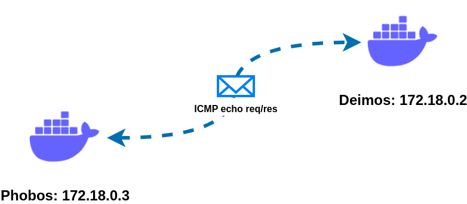

pinging phobos -> deimos

> Ping operates by means of Internet Control Message Protocol (ICMP) packets. Pinging involves sending an ICMP echo request to the target host and waiting for an ICMP echo reply.

**For networking enthusiasts:** ICMP packets pass through the Gateway of 172.18.0.1. The above figure is simply to help you understand our next steps and what we aim to achieve.

First, let’s run the command `ip address ls` to validate the above output obtained from using the `docker network inspect` command. As you can see in Terminal 1.0, you will see the same IP addresses displayed as shown in the above output.

**phobos : 172.18.0.3/16**

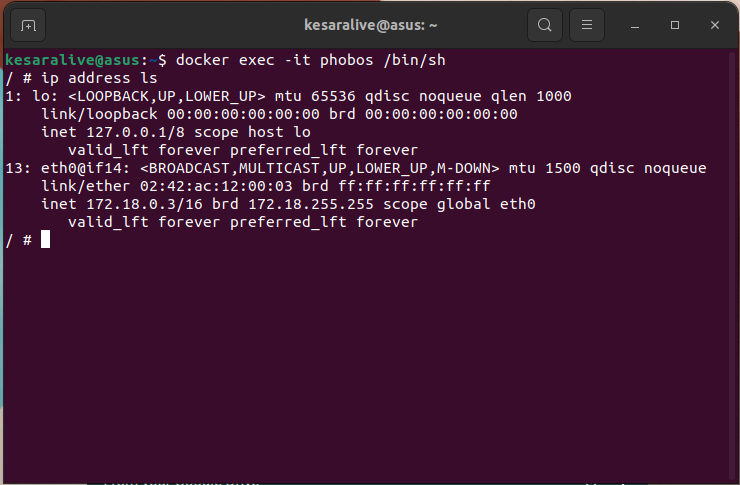

docker exec -it phobos /bin/sh (Terminal 1.0)

Now, let’s test the connectivity between two containers by calling “**deimos**” at IP address **172.18.0.2/16** from “**phobos**” at IP address **172.18.0.3/16**, just like in the figure shown in Terminal 2.0.

```shell
ping 172.18.0.2
```

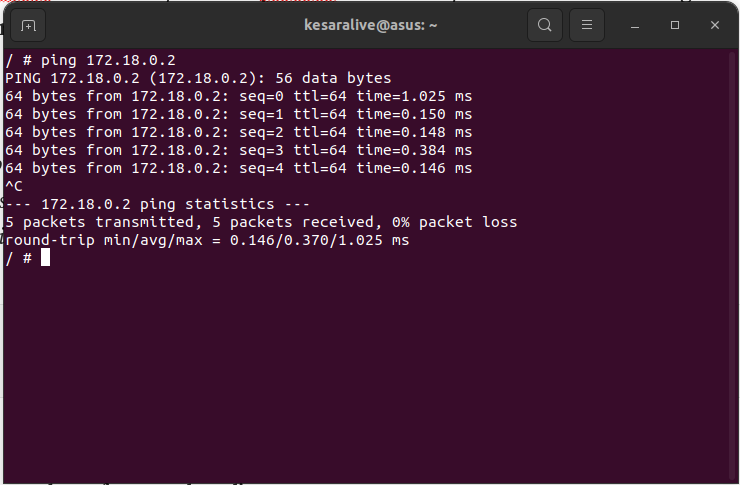

ping 172.18.0.2 (Terminal 2.0)

As shown in the figure Terminal 2.0, if you have followed all the steps correctly so far, you should now be able to successfully transmit packets between the two containers, “**phobos**” and “**deimos**.” This demonstrates the successful establishment of communication between the containers over the created bridge network.

## Docker DNS

When you create a Docker network, Like we discuss earlier, Docker automatically sets up a **bridge network**, which acts as a **virtual network switch** connecting all containers in that network. The **Docker daemon** acts as the **DHCP server** for this bridge network, providing IP addresses to containers and handling their **DNS** resolution.

## **Docker daemon:**

AKA “**Dockerd**,” is a core component of the Docker platform. It is responsible for managing Docker objects like images, containers, networks, and volumes, and it acts as the **_intermediary between the Docker CLI (Command Line Interface) and the container runtime_**. The Docker daemon runs as a background process on the host machine and listens for Docker API requests.

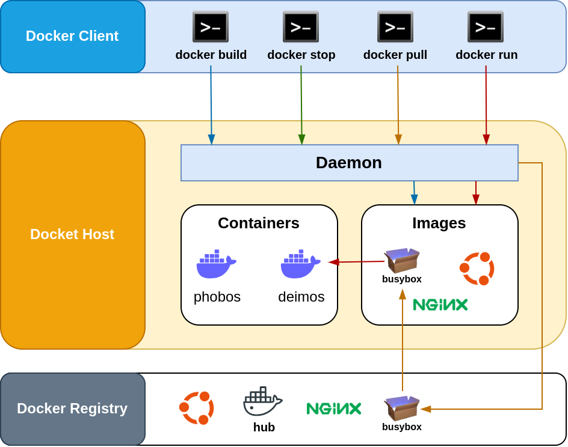

Docker Overview

## DHCP server

A DHCP server is a computer program that automatically assigns IP addresses to devices on a network, simplifying the process of connecting to and communicating with other devices.

## DNS server

A DNS server is a server that translates human-readable domain names (like medium.com) into numerical IP addresses, allowing devices to find and access websites and services on the internet.

If you run `ns lookup medium.com` command in your terminal, you’ll be able to see it’s numerical IP address. You can use it to inspect ip address of a domain name.

## Let’s call deimos again!

If you call “**deimos**” by its name in the same interactive terminal, you will notice that it resolves to the same IP address as before (Terminal 3.0). This behavior occurs because Docker’s internal DNS resolution allows containers to communicate with each other using their assigned names, which are mapped to their respective IP addresses within the Docker network.

```shell
ping deimos
```

Since we’ve given the **container\_name** as **deimos** in our `docker-compose.yaml` we can call our container using it’s name.

> Note: you don’t have to worry about the **_ip configuration_** of a container in a docker network. You can call the container by its name.

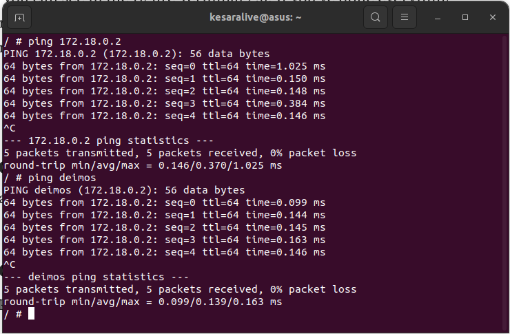

ping deimos (Terminal 3.0)

You can exit from the interactive terminal by entering the `exit` it it.

```shell
exit
```

## Now let’s call phobos from deimos

Like we did in the previous step, we can create an interactive shell session in deimos by running the below command (Terminal 4.0).

```shell
docker exec -it deimos /bin/sh
```

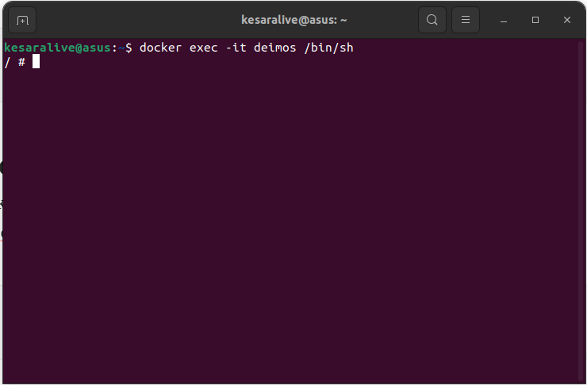

docker exec -it deimos /bin/sh (Terminal 4.0)

Then try to ping `phobos` from **deimos** (Terminal 5.0)

```shell
ping phobos
```

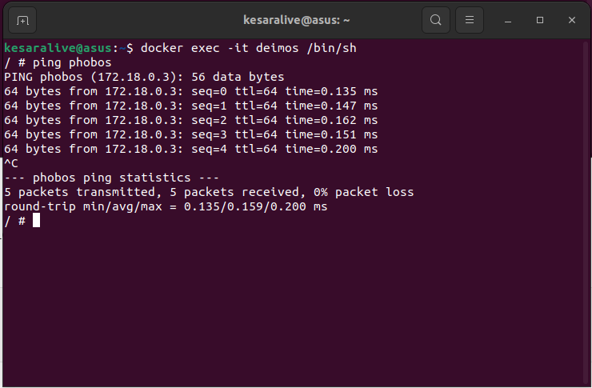

ping phobos (Terminal 5.0)

You should be able to see packets transmitting without any loss.

## Docker Compose: User-Defined Network

So far we didn’t specify any networks in our `docker-compose.yaml` . Eventhough **phobos** & **deimos** can talk to eachother, It’s not yet in the **Mars network**.

So far, we haven’t specified any networks in our `docker-compose.yaml`. Even if the "**phobos**" and "**deimos**" can communicate with each other, they are not yet part of the **Mars network**.

Before going to connect them to **Mars Network**, run the command `docker compose down` in your project directory to remove **phobos** & **deimos** from current configuration.

```
$ docker compose down
[+] Running 2/2
 ✔ Container deimos  Removed    10.3s 
 ✔ Container phobos  Removed  
```

Let’s add “**phobos**” and “**deimos**” to the Mars network. To do that, update the `docker-compose.yaml` file with the following code snippet:

[**docker-compose.yaml**](docker-compose.section-02.yml)

```yaml
version: "3"
services:
  deimos:
    container_name: deimos
    image: busybox
    command: sleep infinity
    networks:
      - mars
  phobos:
    container_name: phobos
    image: busybox
    command: sleep infinity
    networks:
      - mars
networks:
  mars:
    name: mars
    driver: bridge
```

Then run the command `docker compose up -d` again in the terminal inside your project directory.

```shell
$ docker compose up -d
[+] Running 3/3
 ✔ Network mars      Created  0.1s 
 ✔ Container phobos  Started  0.6s 
 ✔ Container deimos  Started  
```

Now, If you run `docker network ls` command, You’ll see our newly created mars network there (Terminal 6.0).

```shell
docker network ls
```

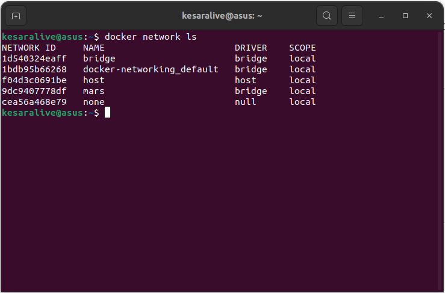

docker network ls (Terminal 6.0)

If we look at the mars network using `docker network inspect mars` you’ll see that **phobos** & **deimos** inside that network.

```shell
$ docker network inspect mars
[
    {
        "Name": "mars",
        "Id": "9dc9407778df9b2bc336a9d4c912c869592889aeb46ae08050a09c81d7e1828d",
        "Created": "2023-07-22T13:42:23.084152643+05:30",
        "Scope": "local",
        "Driver": "bridge",
        "EnableIPv6": false,
        "IPAM": {
            "Driver": "default",
            "Options": null,
            "Config": [
                {
                    "Subnet": "172.21.0.0/16",
                    "Gateway": "172.21.0.1"
                }
            ]
        },
        "Internal": false,
        "Attachable": false,
        "Ingress": false,
        "ConfigFrom": {
            "Network": ""
        },
        "ConfigOnly": false,
        "Containers": {
            "a82fa15fa31548cf3f92e6c90174f1d4a78d7b743186e6f05922c0d1a7d58eb7": {
                "Name": "phobos",
                "EndpointID": "1045e43d6c87e9e245dadaa7d62aed56268320820848b2fd330e9dfe4cd2b4bc",
                "MacAddress": "02:42:ac:15:00:03",
                "IPv4Address": "172.21.0.3/16",
                "IPv6Address": ""
            },
            "aadefe0c9ada96fbf61e1f0f5c3d68dfc4e3685f500f771f147c46bb1e37fb16": {
                "Name": "deimos",
                "EndpointID": "a4dbcb28acc4025438201ce55133a3effe1f6695583d92882a721f6a255dadfa",
                "MacAddress": "02:42:ac:15:00:02",
                "IPv4Address": "172.21.0.2/16",
                "IPv6Address": ""
            }
        },
        "Options": {},
        "Labels": {
            "com.docker.compose.network": "mars",
            "com.docker.compose.project": "docker-networking",
            "com.docker.compose.version": "2.18.1"
        }
    }
]
```

If you try to check the connectivity between `phobos` and `deimos` . It will work like before we tested in the default bridge network.

If you check the connectivity between “**phobos**” and “**deimos**” now, it will work just like before when we tested in the default bridge network. This is because both containers are now part of the “**mars**” bridge network, which enables them to communicate with each other within this designated network.

## Earth Network

Let’s add “**Moon**” and “**Earth**” networks to our `docker-compose.yaml` file. Below is the updated code snippet:


Moon Network

[**docker-compose.yaml**](docker-compose.section-03.yml)

```yaml
version: "3"
services:
  deimos:
    container_name: deimos
    image: busybox
    command: sleep infinity
    networks:
      - mars
  phobos:
    container_name: phobos
    image: busybox
    command: sleep infinity
    networks:
      - mars
  moon:
    container_name: moon 
    image: busybox 
    command: sleep infinity
    networks:
      - earth
networks:
  mars:
    name: mars
    driver: bridge
  earth:
    name: earth 
    driver: bridge
```

1.  Use `docker compose down` to stop & remove previous configuration.
2.  RUN `docker compose up -d` to build and run all the containers.
3.  RUN `docker compose ps` see the running containers.

```shell
$ docker compose ps
NAME                IMAGE               COMMAND             SERVICE             CREATED             STATUS              PORTS
deimos              busybox             "sleep infinity"    deimos              7 seconds ago       Up 5 seconds        
moon                busybox             "sleep infinity"    moon                7 seconds ago       Up 5 seconds        
phobos              busybox             "sleep infinity"    phobos              7 seconds ago       Up 5 seconds    
```

4. RUN `docker network ls` to list all the docker networks. You’ll see that our **mars** & **earth** networks listed there.

```shell
$ docker network ls
NETWORK ID     NAME                        DRIVER    SCOPE
1d540324eaff   bridge                      bridge    local
1bdb95b66268   docker-networking_default   bridge    local
ad19e866e8ad   earth                       bridge    local
f04d3c0691be   host                        host      local
31a102c179b7   mars                        bridge    local
cea56a468e79   none                        null      local
```

5. Let’s try to talk to the **moon (Earth Network)** from the **phobos (Mars Network)**.


Create a interactive shell session in **phobos** and `ping` to the **moon.** (Terminal 7.0)

```shell
docker exec -it phobos /bin/sh
```

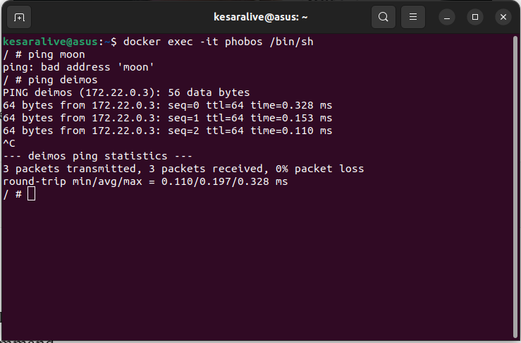

Terminal 7.0

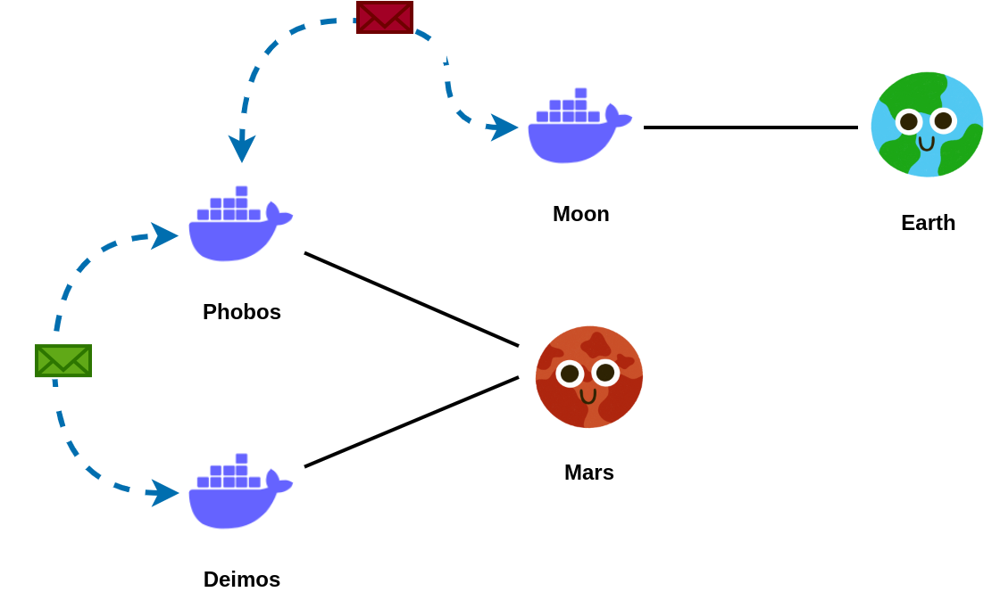

Phobos -> Moon

You will notice that you can’t communicate with “**moon**” from “**phobos**,” but you can still communicate with “**deimos**.” This is because “**deimos**” is part of the same “**Mars Network**” as “**phobos**,” while “**moon**” is in a separate network, “**Earth Network**,” which is not directly accessible from “**Mars Network.**”

5. Let’s inspect the “**Earth Network**” using `docker network inspect earth` command.

```shell
$ docker network inspect earth
[
    {
        "Name": "earth",
        "Id": "ad19e866e8add2936f047fd8ba6315cbded2b5ba8ca544afbc6df0cb5e79ecf4",
        "Created": "2023-07-22T14:26:47.928073948+05:30",
        "Scope": "local",
        "Driver": "bridge",
        "EnableIPv6": false,
        "IPAM": {
            "Driver": "default",
            "Options": null,
            "Config": [
                {
                    "Subnet": "172.23.0.0/16",
                    "Gateway": "172.23.0.1"
                }
            ]
        },
        "Internal": false,
        "Attachable": false,
        "Ingress": false,
        "ConfigFrom": {
            "Network": ""
        },
        "ConfigOnly": false,
        "Containers": {
            "7cc84d8f2854565ab2a63d7aee508861b73539494187b504b4b70f520f7d7af3": {
                "Name": "moon",
                "EndpointID": "86f87b3f0c6a79ade3f301d3811ea4c916e9104821bb7636914172a6f1194960",
                "MacAddress": "02:42:ac:17:00:02",
                "IPv4Address": "172.23.0.2/16",
                "IPv6Address": ""
            }
        },
        "Options": {},
        "Labels": {
            "com.docker.compose.network": "earth",
            "com.docker.compose.project": "docker-networking",
            "com.docker.compose.version": "2.18.1"
        }
    }
]
```

6. Let’s inspect **“Mars Network”** too. command: `docker network inspect mars`

```shell
$ docker network inspect mars
[
    {
        "Name": "mars",
        "Id": "31a102c179b70a6d9b855da6422e0797fa527069f0c324bdc622de5f88805e0c",
        "Created": "2023-07-22T14:26:47.842542312+05:30",
        "Scope": "local",
        "Driver": "bridge",
        "EnableIPv6": false,
        "IPAM": {
            "Driver": "default",
            "Options": null,
            "Config": [
                {
                    "Subnet": "172.22.0.0/16",
                    "Gateway": "172.22.0.1"
                }
            ]
        },
        "Internal": false,
        "Attachable": false,
        "Ingress": false,
        "ConfigFrom": {
            "Network": ""
        },
        "ConfigOnly": false,
        "Containers": {
            "3a20082a7fafca313d04c397ef2389831dc4cf5224e3ca9c0c05bd062e631d9d": {
                "Name": "deimos",
                "EndpointID": "c61ea9206b1f2406402401ee0be8b1ba7e6d540116d21a51cff0c061371a1d10",
                "MacAddress": "02:42:ac:16:00:03",
                "IPv4Address": "172.22.0.3/16",
                "IPv6Address": ""
            },
            "89ebfa3426dd31e6b466a86e8f26796e736f093dbef13f10799c869b242a8202": {
                "Name": "phobos",
                "EndpointID": "ecf6b66097b19985ed8467dc6056911c0fb16e0eb0938c0dfa66b6e2f10bb025",
                "MacAddress": "02:42:ac:16:00:02",
                "IPv4Address": "172.22.0.2/16",
                "IPv6Address": ""
            }
        },
        "Options": {},
        "Labels": {
            "com.docker.compose.network": "mars",
            "com.docker.compose.project": "docker-networking",
            "com.docker.compose.version": "2.18.1"
        }
    }
]
```

You’ll clearly see that these two networks are two different subnets.

**Mars Network**: 172.22.0.0/16

**Earth Network**: 172.23.0.0/16

**Mars** doesn’t know how to talk to **Earth**. That’s why we couldn’t talk to the **moon** from **phobos**.

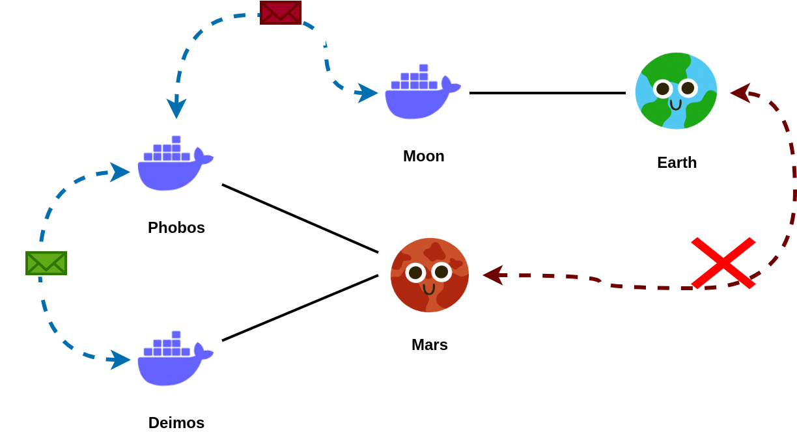

Mars doesn’t know how to talk to Earth

**Phobos** sends ICMP requests to the **Deimos** through the **Mars Network**, Since there’s no connection between **Earth Network** and **Mars Network** **Phobos** can’t send any ICMP requests to the **Moon**.

To communicate between two networks, It’s better to use **overlay network** mode.

## By using a user-defined bridge network, You can achieve the isolation.

Containers connected to a user-defined bridge network are isolated from other networks by default. This ensures that communication between containers is limited to the network they belong to, enhancing security and preventing unintended access.

## Host Network Explanation (Only works on Linux)

⚠️ Note: [Host network driver only works on Linux Hosts](https://docs.docker.com/network/network-tutorial-host/#prerequisites:~:text=The%20host%20networking%20driver%20only%20works%20on%20Linux%20hosts%2C%20and%20is%20not%20supported%20on%20Docker%20Desktop%20for%20Mac%2C%20Docker%20Desktop%20for%20Windows%2C%20or%20Docker%20EE%20for%20Windows%20Server.)  
✅ 1st Part will work in any OS.

Before going to talk about host networks, Let’s see how we mapped our container ports to the host machine’s ports previously in a default bridge network.

To understand the docker Host Network, we’ll use the [nginx docker image](https://hub.docker.com/_/nginx) in this tutorial.

## Nginx Image

Nginx (pronounced “engine-x”) is an open source reverse proxy server for HTTP, HTTPS, SMTP, POP3, and IMAP protocols, as well as a load balancer, HTTP cache, and a web server (origin server).


Nginx server is listening for incoming HTTP requests on port 80

By default, Nginx server will listen for incoming HTTP requests on port 80. When a client (such as a web browser) sends an HTTP request to the server’s IP address or domain name, Nginx will receive the request on port 80, process it, and return the appropriate response back to the client.

Like that in nginx docker image also listens for incoming HTTP requests on port 80. So when we build an nginx container in a docker bridge network, we have to map it’s port 80 to a port in our host machine (your computer).

## In the below example, I’m going to map nginx container’s port 80 to the host machine’s port 8000.

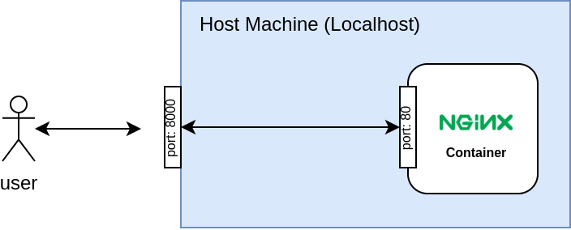

nginx port 80 -> host machine port 8000 mapping

1.  Create a new project folder. (You can name it as you want, I’m naming it docker-host-network)
2.  Create a new `docker-compose.yaml` file and add the bellow code snippet to it.

[**docker-compose.yaml**](docker-compose.section-04.yml)

```yaml
version: "3"
services:
  web:
    container_name: hello_world
    image: nginx
    ports:
      - 8000:80
```

3. RUN the command `docker compose up -d` to build and run the new container.

As we learned before, this will create a default bridge network for the nginx container. Our container will be named “**hello\_world**”. In the port mapping, we’re exposing our container’s port 80 on the Host machine’s port 8000.

If you run `docker compose ps` in your terminal, you’ll see that port mapping there.

```shell
$ docker compose ps
NAME                IMAGE               COMMAND                  SERVICE             CREATED             STATUS              PORTS
hello_world         nginx               "/docker-entrypoint.…"   web                 5 seconds ago       Up 3 seconds        0.0.0.0:8000->80/tcp, :::8000->80/tcp
```

If you visit [http://localhost:8000](http://localhost:8000/) you’ll see the nginx welcome page there.

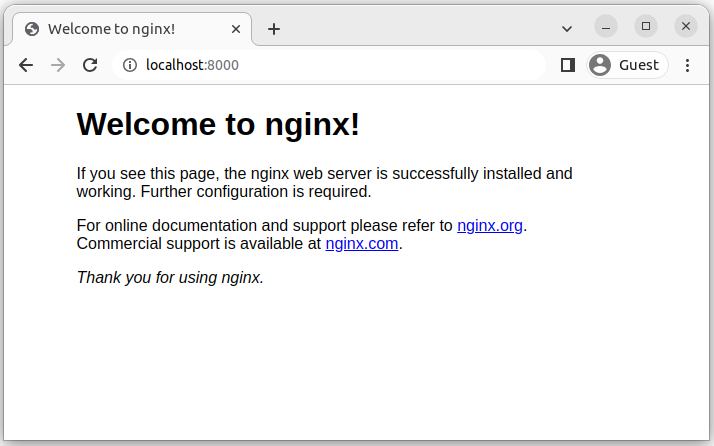

nginx default welcome page.

By using port mapping we can access containers in bridge networks from our local computer (Host machine).

## Bridge network container -> Host network container

Now, let’s see what happens when we move our “**hello\_world**” container (Nginx container) to a **host network.**

1.  First, Let’s stop and remove the previous container by running `docker compose down` command.
2.  Then, You have to update your `docker-compose.yaml` like in the below code snippet.

[**docker-compose.yaml**](https://github.com/kesaralive/docker-networking/tree/main/section-05)

```yaml
version: "3"
services:
  web:
    container_name: hello_world
    image: nginx
    network_mode: host
```

3. By setting `network_mode` to **host** you can add a container to the host network in docker compose.

4. Let’s build & run the “hello\_world” container again by running `docker compose up -d`.

```shell
docker compose up -d
```

5. If you run the command `docker compose ps` now, You won’t see the port mapping there.

```shell
$ docker compose ps
NAME                IMAGE               COMMAND                  SERVICE             CREATED             STATUS              PORTS
hello_world         nginx               "/docker-entrypoint.…"   web                 31 seconds ago      Up 29 seconds       
```

6. But if you access the [http://localhost/](http://localhost/) or [http://127.0.0.1](http://127.0.0.1/)/ in your computer, You’ll be able to access the same page that we’ve accessed before in port 8000.


Nginx default welcome page on [http://127.0.0.1](http://127.0.0.1/)

In a **Host Network**, It allows a Docker container to share the network namespace with the host system like in the below figure. When a container is run in host network mode, it bypasses Docker’s virtual network interface and directly uses the network interfaces of the host machine. This means that the container will have the same network stack as the host, including the same IP address and network interfaces.

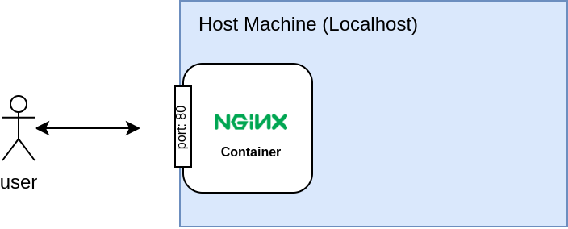

nginx container (hello\_world container) in the Host Network

You might be new to the networking world, and if you don’t have a networking background, you might not know that port 80 is a well-known port for the HTTP protocol. In the networking realm, ports can be categorized into three main types based on their numbers.

1.  Well-Known Ports (0–1023)
2.  Registered Ports (1024–49151)
3.  Dynamic or Private Ports (49152–65535)

Well-Known ports are standardized ports that have been assigned by the [Internet Assigned Numbers Authority](https://iana.org/) (IANA) to specific services and applications. As mentioned earlier, they include ports like 21 (FTP), 22 (SSH), 80 (HTTP), 443 (HTTPS), etc. They are commonly used for widely recognized protocols and services on the internet.

That’s why we didn’t have to enter it like [http://localhost:80/](http://localhost/) or [http://127.0.0.1:80/](http://127.0.0.1/) in the browser. If you do that, it will automatically redirects you to [http://localhost/](http://localhost/) or [http://127.0.0.1](http://127.0.0.1/)/ respectively.


[http://localhost:80](http://localhost/) -> http://localhost

If you run the command `docker network inspect host` you’ll see that our **“hello\_world”** container there.

```shell
$ docker network inspect host
[
    {
        "Name": "host",
        "Id": "f04d3c0691be5113708f0facee709111d1a34567287e0fd13811349ff67fd599",
        "Created": "2023-06-19T00:21:55.411437884+05:30",
        "Scope": "local",
        "Driver": "host",
        "EnableIPv6": false,
        "IPAM": {
            "Driver": "default",
            "Options": null,
            "Config": []
        },
        "Internal": false,
        "Attachable": false,
        "Ingress": false,
        "ConfigFrom": {
            "Network": ""
        },
        "ConfigOnly": false,
        "Containers": {
            "f071b8951047855ab9a3225455e0fd4d459e60a510f41ba921e7277ac886b41c": {
                "Name": "hello_world",
                "EndpointID": "0fc2921ec1503464a153459c470f3a35247a5cdbe323553f44bb1199f099c37f",
                "MacAddress": "",
                "IPv4Address": "",
                "IPv6Address": ""
            }
        },
        "Options": {},
        "Labels": {}
    }
]
```

## That’s how the Docker Host Network Magic works!

If you like to take a further step and try to change the Nginx’s default welcome page, You can do it by using **volumes.**

1.  RUN `docker compose down` to stop and remove the previous container.
2.  UPDATE your `docker-compose.yaml` by adding a **volumes:** field like in the below code snippet.

[**docker-compose.yaml**](docker-compose.section-06.yml)

```yaml
version: "3"
services:
  web:
    container_name: hello_world
    image: nginx
    network_mode: host
    volumes:
      - ./src:/usr/share/nginx/html/
```

3. Then add a folder called `src` inside your project directory.

4. Add a `index.html` file inside it.

**index.html**

```html
<html lang="en">
  <head>
    <meta charset="UTF-8" />
    <meta name="viewport" content="width=device-width, initial-scale=1.0" />
    <title>Hello, World!</title>
  </head>
  <body>
    <h1>Hello, World</h1>
  </body>
</html>
```

5. Now you should have a project directory like below.

```shell
tree .
.
├── src                # source directory. (.html/.js/.css)
│   ├── index.html          # html page 
└── docker-compose.yml
```

6. RUN the command `docker compose up -d` and see the changes in your browser.

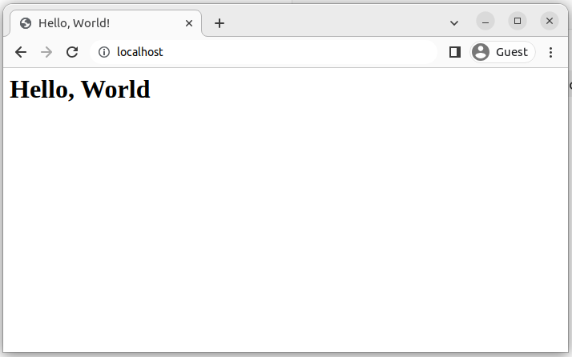

hello, world! page in http://localhost/

Cheers!!! ✨

## Conclusion

In conclusion, this article has focused on two fundamental Docker networking modes: the bridge network and the host network. By exploring the unique characteristics of each, we gained valuable insights into how containers communicate and connect within these network configurations. Whether you’re looking for isolated container communication using bridge networks or opting for direct host network integration, understanding these concepts is crucial in building efficient and secure containerized applications. I hope this article has provided you with the foundational knowledge to navigate Docker networking effectively and confidently.

## Resources:

- **GitHub Repository:** [https://github.com/kesaralive/docker-networking](https://github.com/kesaralive/docker-networking)
- https://www.docker.com/blog/docker-networking-design-philosophy/
- https://stackoverflow.com/questions/70061849/error-pool-overlaps-with-other-one-on-this-address-space
- https://stackoverflow.com/questions/56515128/error-pool-overlaps-with-other-one-on-this-address-space-when-starting-my-proje
- https://straz.to/2021-09-08-docker-address-pools/
- 
