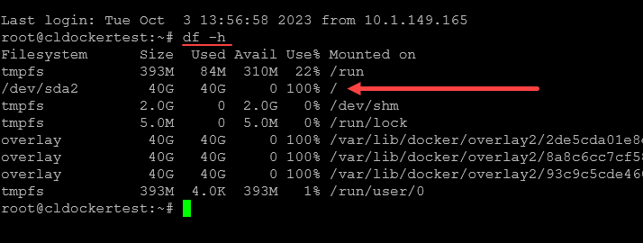
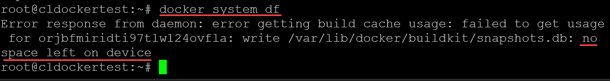
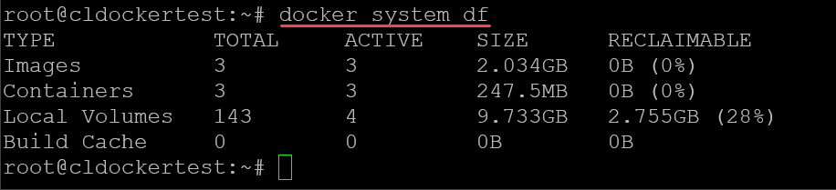
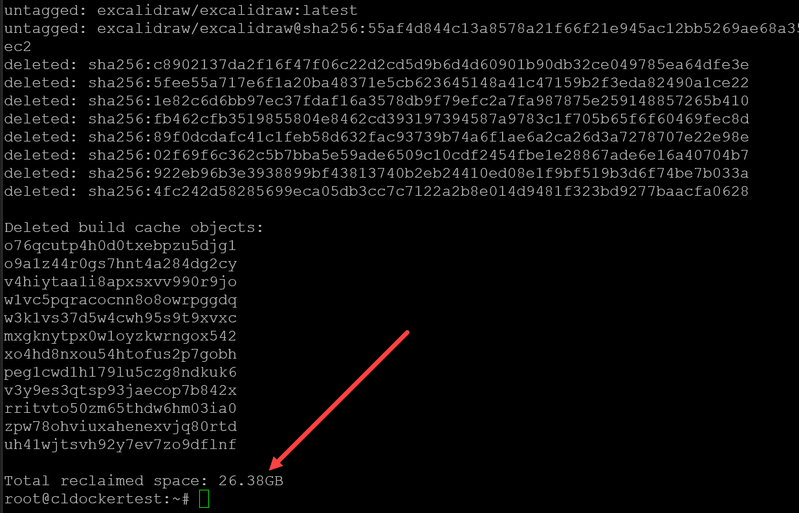
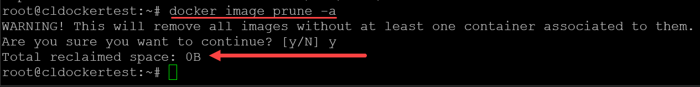
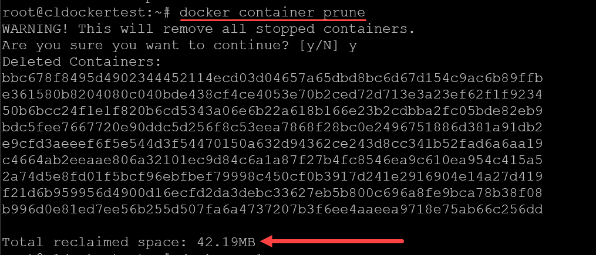
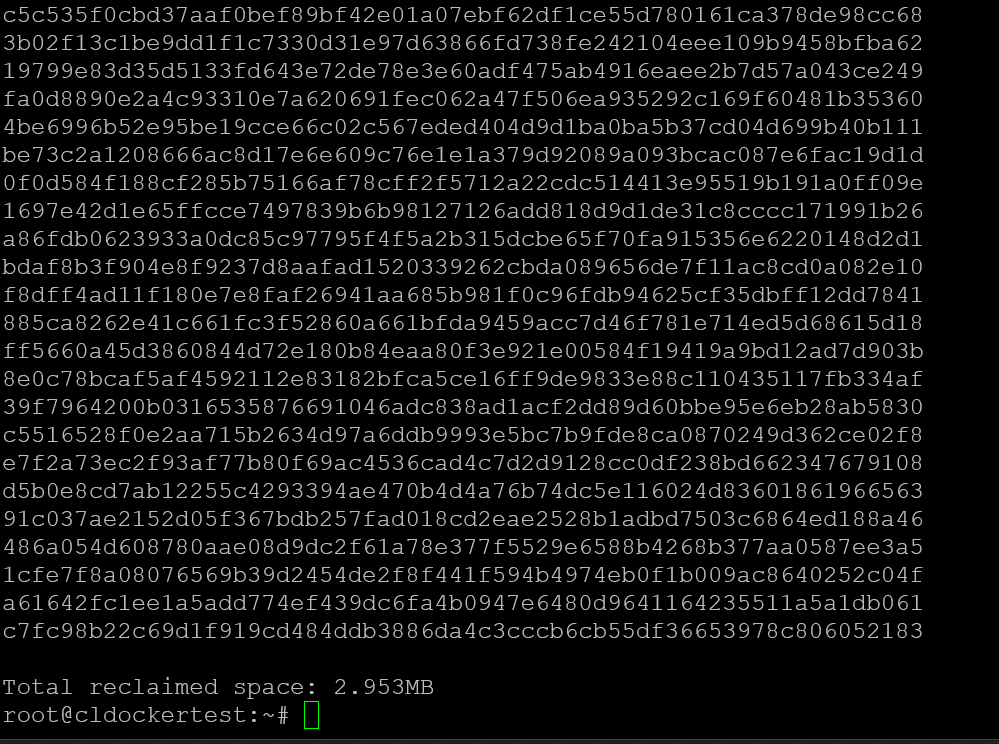
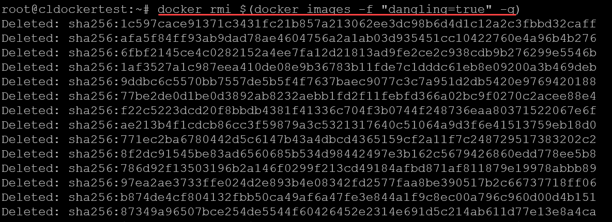

# Docker Overlay2 Cleanup: 5 Ways to Reclaim Disk Space

If you are running Docker containers on a Docker container host, you may have seen issues with disk space. Docker Overlay2 can become a disk space hog if not managed efficiently. This post examines six effective methods for Docker Overlay2 cleanup to reclaim space on your Docker host.

## Disk space issues on a Docker host

If you have run a [Docker host in production or in your home lab](https://www.virtualizationhowto.com/2023/04/excalidraw-whiteboard-ultimate-docker-self-hosted-home-lab-diagramming/), you may have seen something like the following. As you can see on this host, the root partition has all the space used. Interestingly, you an see as well the **overlay** filesystem listed.



Disk full which needs docker overlay2 cleanup

## What is the Overlay file system?

The Overlay File System, often shortened to OverlayFS, is a type of union file system. It helps the [Docker engine manage containers](https://www.virtualizationhowto.com/2023/04/ansible-docker-container-management-playbooks/) and images by optimizing disk space usage.

In simple terms, it allows Docker to store and organize files in a way that keeps [disk space](https://www.virtualizationhowto.com/2022/09/proxmox-create-iso-storage-location-disk-space-error/) usage minimal. It also helps ensure quick access to files when needed.

Here’s how it works:

### Filesystem layers structure

OverlayFS operates on the principle of layers. Each action in Docker creates a new layer.

Each layer is stacked on top of each other. This forms a layered structure. When you modify a file, only the layer containing the file is updated, and the other layers are not modified. This layered file system is one of the ways [Docker containers are easily moved between hosts](https://www.virtualizationhowto.com/2022/12/move-docker-container-to-another-host/) and environments.

### Disk space usage

With this, Docker makes sure that files shared across many different containers or images are stored just once. It saves a lot of disk space. When a container needs to read a file, it reads between the file layers from top to bottom until the file needed is found.

Similarly, when a file is modified, a new layer is created, ensuring that the original file remains unaltered and can be used by other containers.

### Overlay and Overlay2

Docker has two versions of the Overlay file system: Overlay and Overlay2. Overlay2 is an improved version, providing better performance and reliability compared to its predecessor. The **/var/lib/docker/overlay2** directory is where Docker stores all these layers on your host system.

Over time, as more [containers and images](https://www.virtualizationhowto.com/2021/05/new-windows-server-2022-container-image-preview-install/) are created and deleted, this directory can grow in size and become huge.

## 1\. Utilizing Docker’s Built-In Commands for Docker Overlay2 Cleanup

Docker arms you with a suite of built-in commands designed to provide a quick overview and cleanup of disk space:

### Docker System Overview

Initiate your cleanup crusade by understanding the space occupancy with the **docker system df** command. This command is your window into the space consumed by images, containers, and local volumes on your Docker host.

```console
$ docker system df
$ 
$ # for a detailed view 
$ docker system df -v 
```

However, one thing you may find, if your host is 100% full, the docker system df command may not be able to run.



Docker system df command

If you have the headroom for the command to run, you will see an output that looks like this:



Running the docker system df with normal output

### Prune Unwanted Docker Objects

Docker prune is a built-in mechanism to reclaim space. Depending on your Docker version, The **docker system prune** command filters through your Docker system, removing stopped containers, networks unassociated with any container, and dangling images.

You can include the **\-a** flag to remove all unused images. The **\-f** flag is a force operation.

It is worth restating this WARNING:

```console
WARNING! This will remove:
        - all stopped containers
        - all networks not used by at least one container
        - all dangling images
        - all build cache
```

```
$ docker system prune -a -f
```

Out of all the built-in tools and scripts I have tried, this yields the most total reclaimed space.



Docker overlay2 cleanup using docker system prune command

### Addressing Dangling and Unused Images

Dangling and unused images are like the old books on your shelf collecting dust. The **[docker image](https://www.virtualizationhowto.com/2022/09/iis-to-docker-image-with-windows-admin-center/) prune** command is your dusting tool, cleaning up these outdated images and reclaiming the lost space.

```console
$ docker image prune -a
```

This may or may not yield much in terms of disk space.



Pruning docker images

### Container and Volume Prune

Similarly, **[docker container](https://www.virtualizationhowto.com/2022/05/best-docker-containers-for-home-server/) prune** and **docker volume prune** are your allies in removing stopped containers and unused volumes, respectively.

```console
#Prune docker containers
$ docker container prune

#Prune docker volumes
$ docker volume prune
```



Docker container prune when troubleshooting docker overlay2 cleanup

Results below of docker volume prune.



Docker overlay2 cleanup with docker volume prune

## 2\. Manual Deletion

When the built-in commands fall short for Docker overlay2 cleanup, or you desire more control, manual deletion is the way to go.

### Deleting Unused Images and Unused Containers

Manually remove dangling or unused images and containers with precision using the following commands:

```console
# Remove dangling images 
$ docker rmi $(docker images -f "dangling=true" -q) 

# Remove exited containers 
$ docker rm -v $(docker ps -aq -f status=exited)
```



Removing dangling and exited containers manually

### Checking Disk Usage

A wise Docker user is one who keeps tabs on disk usage. The **df -h** and **du** commands are your eyes into the disk space usage, helping identify the large files or directories.

```console
$ df -h du -sch /var/lib/docker/overlay2
```

## 3\. Log Management

The container’s logs are vital but can be space-consuming, even if not directly related to Docker overlay2 cleanup. Restrict log files size by modifying the log parameters in **/etc/docker/daemon.json** and restarting the Docker daemon.

```console
# Edit the daemon.json file 
$ vi /etc/docker/daemon.json 

# Add the following entries 
{ "log-driver":"json-file", "log-opts": {"max-size":"3m", "max-file":"1"} } 

# Restart the Docker daemon 
$ systemctl daemon-reload systemctl restart docker
```

## 4\. Specialized Cleanup in a Kubernetes Context

In a [Kubernetes setup](https://www.virtualizationhowto.com/2021/07/setup-kubernetes-ubuntu-20-04-step-by-step-cluster-configuration/), a more nuanced approach is needed. Draining nodes, stopping the kubelet and Docker services, followed by a comprehensive Docker cleanup can reclaim significant disk space.

```console
# Drain the node 
$ kubectl drain this_node --ignore-daemonsets --delete-local-data 

# Stop kubelet service 
$ kubelet stop 

# Restart Docker 
$ service docker restart
 
# Clean up Docker 
$ docker system prune --all --volumes --force
```

These methods, when employed judiciously, will help you keep a healthy disk space, ensuring Docker Overlay2 remains an asset, not a liability. Happy Dockering!

## 5\. Completely refresh docker

You can completely refresh docker using the following steps:

To refresh Docker to a clean state and ensure Docker overlay2 cleanup, you can delete the entire directory, including but not limited to the Overlay2 directory.

```console
# You are entering the danger zone - this will delete data
$ sudo -s
$ systemctl stop docker
$ rm -rf /var/lib/docker
$ systemctl start docker
```

## Frequently Asked Questions

**What causes the /var/lib/docker/overlay2 directory to grow in size?**

The /var/lib/docker/overlay2 directory is the hub where Docker stores the layers of your containers and images. Each time a new container or image is created, a new layer is added to this directory. Similarly, when you update or modify containers or images, additional layers are created.  
Over time, these layers accumulate, causing the directory to swell in size. It’s important that you keep a close watch on this directory and perform regular cleanups. It helps to make sure your Docker host doesn’t run out of disk space.

**How can I check the disk space used by Docker containers?**

Use the **docker system df** command. It provides summary of the space usage. However, as shown earlier, if the disk is 100% full, it may error when running the command

**Is there a way to set a disk space limit for Docker containers?**

You can use the **–storage-opt** flag when you run the docker create or docker run command. To set a disk space limit of 10GB for a container, you would use the command **docker run –storage-opt size=10G image\_name**.

**What’s the difference between docker system prune and docker image prune commands?**

The docker system prune command is a more extensive cleanup command compared to docker image prune. While docker image prune targets only unused and dangling images, docker system prune goes a step further to remove stopped containers, networks not in use, and also all unused images if used with the -a flag. It’s a handy command to free up space across the Docker system.

**How does Docker Overlay2 compare to other storage drivers?**

Docker Overlay2 has a significant advantage in terms of disk space efficiency due to its layered file system structure. Unlike other storage drivers that might duplicate common files across different containers or images, Overlay2 stores common files just once, saving a substantial amount of disk space.  
However, each storage driver has its unique set of features and might be suited for different scenarios based on performance, consistency, and other operational requirements.

**Can I switch to a different storage driver once Docker is already installed?**

Yes, but switching storage drivers is not a straightforward task and requires a good understanding of Docker and its configuration.  
It involves stopping Docker, moving or deleting the /var/lib/docker directory, configuring the new storage driver in the Docker configuration file, and restarting Docker. It’s advisable to backup your Docker data before attempting to switch storage drivers.

**What are some common issues encountered with the Docker Overlay2 file system?**

Some common issues include disk space running out due to accumulated old images, containers, and volumes, as well as difficulties in mapping overlay folders to the corresponding containers or images. Understanding the Docker Overlay2 file system and using Docker’s built-in cleanup commands can help mitigate these issues and maintain a healthy Docker environment.

## Wrapping up

Running a Docker host is a great way to easily deploy applications. However, if you have run into the issue where your disk space is getting filled up on your Docker host, generally, the Overlay2 directory is the culprit. You can use the methods described to free up disk space on your Docker host. The docker system prune -a -f command is especially helpful.

## Reference

- https://www.virtualizationhowto.com/2023/11/docker-overlay2-cleanup-5-ways-to-reclaim-disk-space/
