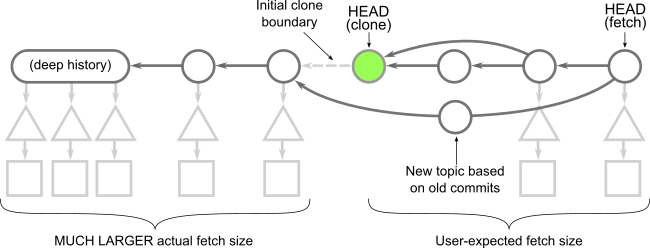

# Get up to speed with partial clone and shallow clone

As your Git repositories grow, it becomes harder and harder for new developers to clone and start working on them. Git is designed as a _distributed_ version control system. This means that you can work on your machine without needing a connection to a central server that controls how you interact with the repository. This is only fully realizable if you have all reachable data in your local repository.

What if there was a better way? Could you get started working in the repository without downloading every version of every file in the entire Git history? Git’s **partial clone** and **shallow clone** features are options that can help here, but they come with their own tradeoffs. Each option breaks at least one expectation from the normal distributed nature of Git, and you might not be willing to make those tradeoffs.

If you are working with an extremely large monorepo, then these tradeoffs are more likely to be worthwhile or even _necessary_ to interact with Git at that scale!

Before digging in on this topic, be sure you are familiar with how Git stores your data, including [commits, trees, and blob objects](https://github.blog/2020-12-17-commits-are-snapshots-not-diffs/). Some of these ideas and other helpful tips can be found at GitHub Universe, [Optimize your monorepo experience](https://githubuniverse.com/Optimize-your-monorepo-experience/).

### Quick Summary

There are three ways to reduce clone sizes for repositories hosted by GitHub.

-   `git clone --filter=blob:none <url>` creates a _blobless clone_. These clones download all reachable commits and trees while fetching blobs on-demand. These clones are best for developers and build environments that span multiple builds.
-   `git clone --filter=tree:0 <url>` creates a _treeless clone_. These clones download all reachable commits while fetching trees and blobs on-demand. These clones are best for build environments where the repository will be deleted after a single build, but you still need access to commit history.
-   `git clone --depth=1 <url>` creates a _shallow clone_. These clones truncate the commit history to reduce the clone size. This creates some unexpected behavior issues, limiting which Git commands are possible. These clones also put undue stress on later fetches, so they are strongly discouraged for developer use. They are helpful for some build environments where the repository will be deleted after a single build.

## Full clones

As we discuss the different clone types, we will use a common representation of Git objects:

-   Boxes are **blobs**. These represent file contents.
-   Triangles are **trees**. These represent directories.
-   Circles are **commits**. These are snapshots in time.

We use arrows to represent a relationship between objects. Basically, if an OID `B` appears inside a commit or tree `A`, then the object `A` has an arrow to the object `B`. If we can follow a list of arrows from an object `A` to another object `C`, then we say `C` is _reachable_ from `A`. The process of following these arrows is sometimes referred to as _walking objects_.

We can now describe the data downloaded by a `git clone` command! The client asks the server for the latest commits, then the server provides those objects _and every other reachable object_. This includes every tree and blob in the entire commit history!

In this diagram, time moves from left to right. The arrows between a commit and its parents therefore go from right to left. Each commit has a single root tree. The root tree at the `HEAD` commit is fully expanded underneath, while the rest of the trees have arrows pointing towards these objects.

This diagram is purposefully simple, but if your repository is very large you will have many commits, trees, and blobs in your history. Likely, the historical data forms a majority of your data. Do you actually need all of it?

These days, many developers always have a network connection available as they work, so asking the server for a little more data when necessary might be an acceptable trade-off.

This is the critical design change presented by partial clone.

## Partial clone

Git’s partial clone feature is enabled by specifying [the `--filter` option in your `git clone` command](https://git-scm.com/docs/git-clone#Documentation/git-clone.txt---filterltfilter-specgt). The full list of filter options exist in [the `git rev-list` documentation](https://git-scm.com/docs/git-rev-list#Documentation/git-rev-list.txt---filterltfilter-specgt), since you can use `git rev-list --filter=<filter> --all` to see which objects in your repository match the filter. There are several filters available, but the server can choose to deny your filter and revert to a full clone.

On `github.com` and GitHub Enterprise Server 2.22+, there are two options available:

1.  **Blobless clones:** `git clone --filter=blob:none <url>`
2.  **Treeless clones:** `git clone --filter=tree:0 <url>`

Let’s investigate each of these options.

### Blobless clones

When using the `--filter=blob:none` option, the initial `git clone` will download all reachable commits and trees, and only download the blobs for commits when you do a `git checkout`. This includes the first checkout inside the `git clone` operation. The resulting object model is shown here:

The important thing to notice is that we have a copy of every blob at `HEAD` but the blobs in the history are not present. If your repository has a deep history full of large blobs, then this option can significantly reduce your `git clone` times. The commit and tree data is still present, so any subsequent `git checkout` only needs to download the missing blobs. The Git client knows how to batch these requests to ask the server only for the missing blobs.

Further, when running `git fetch` in a blobless clone, the server only sends the new commits and trees. The new blobs are downloaded only after a `git checkout`. Note that `git pull` runs `git fetch` and then `git merge`, so it will download the necessary blobs during the `git merge` command.

When using a blobless clone, you will trigger a blob download whenever you need the _contents_ of a file, but you will not need one if you only need the OID of a file. This means that `git log` can detect which commits changed a given path without needing to download extra data.

This means that blobless clones can perform commands like `git merge-base`, `git log`, or even `git log -- <path>` with the same performance as a full clone.

Commands like `git diff` or `git blame <path>` require the contents of the paths to compute diffs, so these will trigger blob downloads the first time they are run. However, the good news is that after that you will have those blobs in your repository and do not need to download them a second time. Most developers only need to run `git blame` on a small number of files, so this tradeoff of a slightly slower `git blame` command is worth the faster clone and fetch times.

Blobless clones are the most widely-used partial clone option. I’ve been using them myself for months without issue.

### Treeless clones

In some repositories, the tree data might be a significant portion of the history. Using `--filter=tree:0`, a treeless clone downloads all reachable commits, then downloads trees and blobs on demand. The resulting object model is shown here:

Note that we have all of the data at `HEAD`, but otherwise only have commit data. This means that the initial clone can be _much_ faster in a treeless clone than in a blobless or full clone. Further, we can run `git fetch` to download only the latest commits. However, working in a treeless clone is more difficult because downloading a missing tree when needed is more expensive.

For example, a `git checkout` command changes the `HEAD` commit, usually to a commit where we do not have the root tree. The Git client then asks the server for that root tree by OID, but also for all reachable trees from that root tree. Currently, this request does not tell the server that the client already has some root trees, so the server might send many trees the client already has locally. After the trees are downloaded, the client can detect which blobs are missing and request those in a batch.

It is possible to work in a treeless clone without triggering too many requests for extra data, but it is much more restrictive than a blobless clone.

For example, history operations such as `git merge-base` or `git log` (without extra options) only use commit data. These will not trigger extra downloads.

However, if you run a file history request such as `git log -- <path>`, then a treeless clone will start downloading root trees for almost every commit in the history!

We **strongly recommend** that developers do not use treeless clones for their daily work. Treeless clones are really only helpful for automated builds when you want to quickly clone, compile a project, then throw away the repository. In environments like GitHub Actions using public runners, you want to minimize your clone time so you can spend your machine time actually building your software! Treeless clones might be an excellent option for those environments.

⚠️ **Warning:** While writing this article, we were putting treeless clones to the test beyond the typical limits. We noticed that repositories that contain _submodules_ behave very poorly with treeless clones. Specifically, if you run `git fetch` in a treeless clone, then the logic in Git that looks for changed submodules will trigger a tree request for every new commit! This behavior can be avoided by running `git config fetch.recurseSubmodules false` in your treeless clones. We are working on a more robust fix in the Git client.

## Shallow clones

Partial clones are relatively new to Git, but there is an older feature that does something very similar to a treeless clone: shallow clones. Shallow clones use [the `--depth=<N>` parameter in `git clone`](https://git-scm.com/docs/git-clone#Documentation/git-clone.txt---depthltdepthgt) to truncate the commit history. Typically, `--depth=1` signifies that we only care about the most recent commits. Shallow clones are best combined with the `--single-branch --branch=<branch>` options as well, to ensure we only download the data for the commit we plan to use immediately.

The object model for a shallow clone is shown in this diagram:

Here, the commit at `HEAD` exists, but its connection to its parents and the rest of the history is severed. The commits whose parents are removed are called _shallow commits_ and together form the _shallow boundary_. The commit objects themselves have not changed, but there is some metadata in the client repository directing the Git client to ignore those parent connections. All trees and blobs are downloaded for any commit that exists on the client.

Since the commit history is truncated, commands such as `git merge-base` or `git log` show different results than they would in a full clone! In general, you cannot count on them to work as expected. Recall that these commands work as expectedly in partial clones. Even in blobless clones, commands like `git blame -- <path>` will work correctly, if only a little slower than in full clones. Shallow clones don’t even make that a possibility!

The other major difference is how `git fetch` behaves in a shallow clone. When fetching new commits, the server must provide every tree and blob that is “new” to these commits, relative to the shallow commits. This computation can be more expensive than a typical fetch, partly because a well-maintained server can make use of [reachability bitmaps](https://github.blog/2015-09-22-counting-objects/). Depending on how others are contributing to your remote repository, a `git fetch` operation in a shallow clone might end up downloading an almost-full commit history!

Here are some descriptions of things that can go wrong with shallow clones that negate the supposed values. For these reasons we **do not recommend shallow clones** except for builds that delete the repository immediately afterwards. Fetching from shallow clones can cause more harm than good!

Remember the “shallow boundary” mentioned earlier? The client sends that boundary to the server during a `git fetch` command, telling the server that it doesn’t have all of the reachable commits behind that boundary. The client then asks for the latest commits and everything reachable from those _until hitting a shallow commit in the boundary_. If another user starts a topic branch below that boundary and then the shallow client fetches that topic (or worse, the topic is merged into the default branch), then the server needs to walk the full history and serve the client what amounts to almost a full clone! Further, the server needs to calculate that data without the advantage of performance features like reachability bitmaps.

## Comparing Clone Options

Let’s recall each of our clone options. Instead of looking them at a pure object level, let’s explore each category of object. The figures below group the data that is downloaded by each repository type. In addition to the data downloaded at clone, let’s consider the situation where some time passes and then the client runs `git fetch` and then `git checkout` to move to a new commit. For each of these options, how much data is downloaded.

Full clones download all reachable objects. Typically, blobs are responsible for most of this data.

In a partial clone, some data is not served immediately and is delayed until the client needs it. Blobless clones skip blobs except those needed at checkout time. Treeless clones skip all trees in the history in favor of downloading a full copy of the trees needed for each checkout.

## What do the numbers say?

There are many different types of clones beyond the default full clone. If you truly need to have a distributed workflow and want all of the data in your local repository, then you should continue using full clones. If you are a developer focused on a single repository and your repository is reasonably-sized, the best approach is to do a full clone.

You might switch to a blobless partial clone if your repository is very large due to many large blobs, as that clone will help you get started more quickly. The trade-off is that some commands such as `git checkout` or `git blame` will require downloading new blob data when necessary.

In general, calculating a shallow fetch is computationally more expensive compared to a full fetch. Always use a full fetch instead of a shallow fetch both in fully and shallow cloned repositories.

In workflows such as CI builds when there is a need to do a single clone and delete the repository immediately, shallow clones are a good option. Shallow clones are the fastest way to get a copy of the working directory at the tip commit with the additional cost that fetching from these repositories is much more expensive, so we do not recommend shallow clones for developers. If you need the commit history for your build, then a treeless partial clone might work better for you than a full clone.

In general, _your mileage may vary_. Now that you are armed with these different options and the object model behind them, you can go and play with these kinds of clones. You should also be aware of some pitfalls of these non-full clone options:

-   Shallow clones skip the commit history. This makes commands such as `git log` or `git merge-base` unavailable. Never fetch from a shallow clone!
-   Treeless clones contain commit history, but it is very expensive to download missing trees. Thus, `git log` (without a path) and `git merge-base` are available, but commands like `git log -- <path>` and `git blame` are extremely slow and not recommended in these clones.
-   Blobless clones contain all reachable commits and trees, so Git downloads blobs when it needs access to file contents. This means that commands like `git log -- <path>` are available but commands like `git blame` are a bit slower on their first run. However, this can be a great way to get started on a very large repository with a lot of old, large blobs.
-   Full clones work as expected. The only downside is the time required to download all of that data, plus the extra disk space for all those files.

Be sure to upgrade to [the latest Git version](https://github.blog/2020-10-19-git-2-29-released/) so you have all the latest performance improvements!

## Reference

- https://github.blog/2020-12-21-get-up-to-speed-with-partial-clone-and-shallow-clone/

