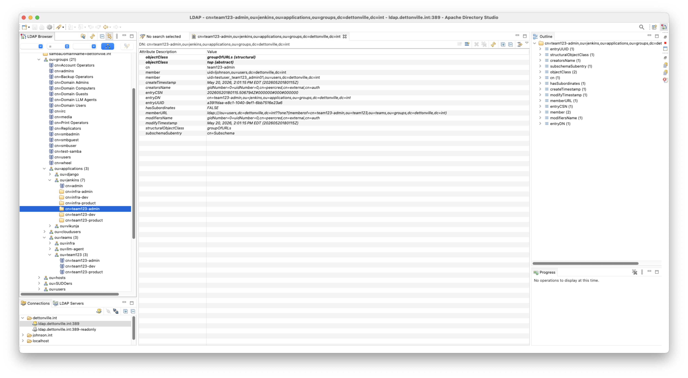
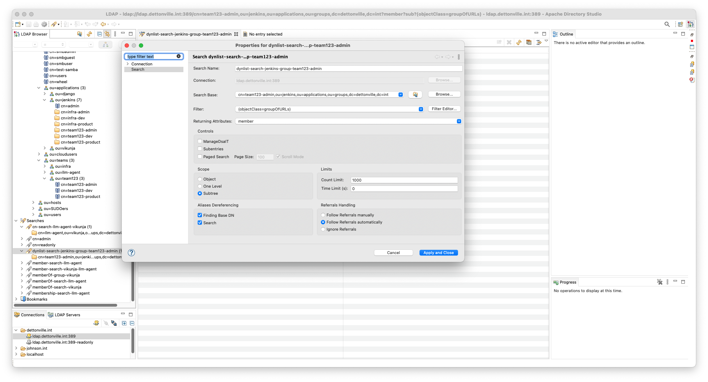

# OpenLDAP Dynamic Group Resolution using the Dynlist Overlay

This document provides a guide and reference example for leveraging OpenLDAP's `dynlist` overlay to manage application-specific team access. This approach avoids duplicate entries and prevents configuration drift by dynamically referencing existing, HR-managed organizational teams.

---

## Architectural Concept

In this architecture, organizational teams are managed and maintained by automated HR or identity processes. Because team memberships change frequently, duplicating these rosters into application-specific groups introduces significant overhead and risk of configuration drift.

To solve this, we create application-specific group references within the application's Organizational Unit (`ou`). These references use the `groupOfURLs` object class. The `dynlist` overlay intercepts queries to these reference groups, evaluates their embedded `memberURL` filter, and dynamically injects the target group's members on the fly.

### Directory Structure Example
The directory layout below demonstrates how application references map back to central organizational teams:

```text
dc=dettonville,dc=int
├── ou=groups
│   ├── ou=teams (Managed by central identity/HR processes)
│   │   └── cn=team123-admin,ou=team123,ou=teams,ou=groups... (Target Group)
│   │
│   └── ou=applications
│       └── ou=jenkins (Application-specific OU)
│           └── cn=team123-admin,ou=jenkins,ou=applications... (Dynamic Reference)
└── ou=users
    ├── uid=ljohnson
    └── uid=testuser_team123_admin01
```

---

## Technical Example

### 1. Target Organizational Team (Source of Truth)
This is the base group populated by core identity systems:
* **DN:** `cn=team123-admin,ou=team123,ou=teams,ou=groups,dc=dettonville,dc=int`

### 2. Application Reference Group (Dynamic Pointer)
This entry is created inside the Jenkins application OU. It points to the target organizational team using an LDAP URI filter inside the `memberURL` attribute:
* **DN:** `cn=team123-admin,ou=jenkins,ou=applications,ou=groups,dc=dettonville,dc=int`
* **Object Class:** `groupOfURLs`
* **Key Attribute:** ```text
  memberURL: ldap:///ou=users,dc=dettonville,dc=int??one?(memberof=cn=team123-admin,ou=team123,ou=teams,ou=groups,dc=dettonville,dc=int)
  ```

---

## How to Query Dynamic Members via `ldapsearch`

When querying a group using the `dynlist` overlay, you must explicitly request the `member` attribute at the end of your command. Because `member` fields are dynamically generated by the overlay, they are operational attributes and will often be omitted from standard wildcard searches.

### The Command

Run the following command to retrieve the evaluated membership list:

```shell
ldapsearch -x \
  -H ldap://ldap.dettonville.int:389 \
  -D "cn=readonly,dc=dettonville,dc=int" \
  -w "${LDAP_PASSWORD}" \
  -b "cn=team123-admin,ou=jenkins,ou=applications,ou=groups,dc=dettonville,dc=int" \
  -s base \
  "(objectClass=groupOfURLs)" \
  member
```

### Command Flags Breakdown

| Flag | Purpose |
| :--- | :--- |
| `-x` | Uses simple authentication instead of SASL. |
| `-H` | Specifies the LDAP directory server URI. |
| `-D` | The Bind DN used to authenticate the query. |
| `-w` | Passes the Bind DN password via environment variable (`${LDAP_PASSWORD}`). Use `-W` instead to prompt interactively. |
| `-b` | Sets the search base directly to the application reference entry. |
| `-s base` | Limits the scope to the base object. This drastically optimizes performance by telling OpenLDAP to evaluate only this specific entry. |
| `member` | Explicitly requests the dynamic attribute generated by the `dynlist` overlay. |

### Expected Output

When successful, the `dynlist` overlay returns the evaluated results as distinct `member` lines without altering the underlying group entry in the directory database:

```ldif
# extended LDIF
#
# LDAPv3
# base <cn=team123-admin,ou=jenkins,ou=applications,ou=groups,dc=dettonville,dc=int> with scope baseObject
# filter: (objectClass=groupOfURLs)
# requesting: member 
#

# team123-admin, jenkins, applications, groups, dettonville.int
dn: cn=team123-admin,ou=jenkins,ou=applications,ou=groups,dc=dettonville,dc=int
member: uid=ljohnson,ou=users,dc=dettonville,dc=int
member: uid=testuser_team123_admin01,ou=users,dc=dettonville,dc=int

# search result
search: 2
result: 0 Success

# numResponses: 2
# numEntries: 1
```

---

## Apache Directory Studio

The dynamically queried members can also be seen in **apache directory studio**:


The same query as the aforementioned ldapsearch using **apache directory studio**:


---

## Troubleshooting & Engineering Notes

> [!IMPORTANT]
> **Permission Issues and Empty Responses**
> If your `ldapsearch` query returns the group entry successfully but the `member:` keys are missing entirely from the output, the issue is almost always caused by an Access Control List (ACL) restriction. 
> 
> The `dynlist` overlay evaluates the `memberURL` using the context of the user binding to the directory (in this case, `cn=readonly`). If the bind user does not have explicit `read` or `search` access to **both** the application group entity *and* the target user objects residing under `ou=users,dc=dettonville,dc=int`, the overlay will silently drop the generated attributes. Ensure your `slapd.access` rules grant sufficient access to your application/lookup service accounts.
