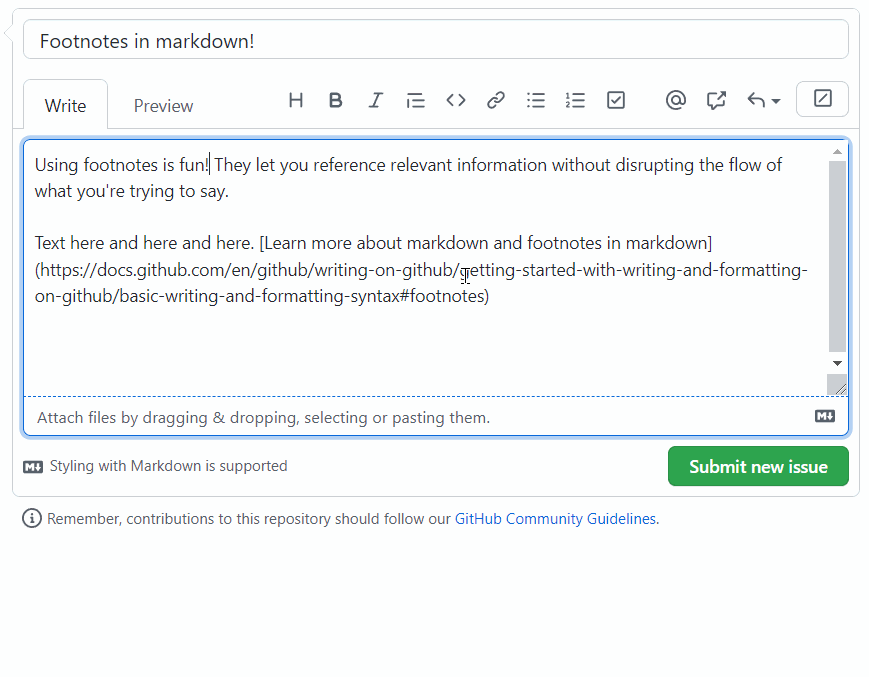

Footnotes let you reference relevant information without disrupting the flow of what you're trying to say:

```
Here is a simple footnote[^1]. With some additional text after it.

[^1]: My reference.
```

You can now use footnote syntax in any Markdown field!

Footnotes are displayed as superscript links. Click them to jump to their referenced information, displayed in a new section at the bottom of the document:



Learn more about [using footnotes in Markdown](https://docs.github.com/github/writing-on-github/getting-started-with-writing-and-formatting-on-github/basic-writing-and-formatting-syntax#footnotes).
