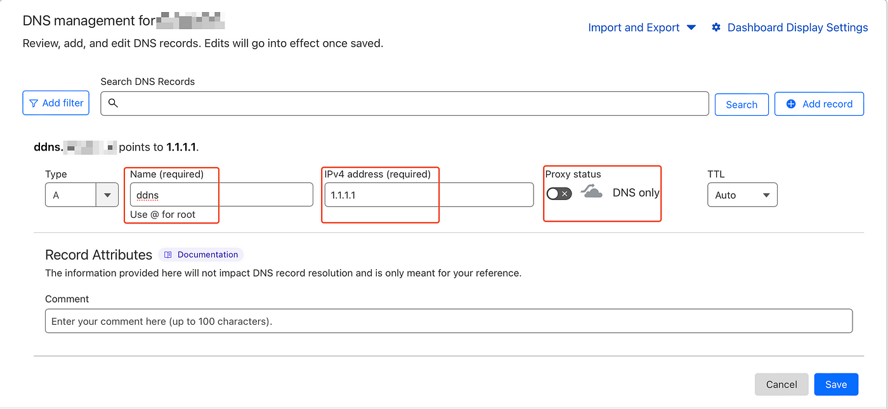

# Setting Up DDNS on PfSense using CloudFlare

I understand the excitement and challenges that come with building and maintaining your own personal network. One aspect that often poses a hurdle is documenting the steps we take to set up and manage various components. This guide is not only a step-by-step tutorial on how to set up Dynamic DNS (DDNS) on PfSense using CloudFlare but also a personal chronicle of my home lab journey. By sharing my experience, I hope to not only assist others in similar endeavors but also create a comprehensive record for my own future reference.

I am assuming anyone reading this already knows what DDNS is and why it is used so lets get into the steps.

## CloudFlare

Log in to your CloudFlare account, select your domain, and access DNS settings. Create a new “A” record with a chosen subdomain name _(e.g., “ddns”)_ and set the temporary IPv4 address as _“1.1.1.1”_. This will be changed automatically (_to your public IP_) once we configure this domain on PfSense.

> Make sure to disable the **Proxied** option. If you use this domain for your OpenVPN tunnel, it won’t work.

To proceed, you’ll need your CloudFlare Global API key. Within your domain settings, find this key by heading to the bottom right corner and selecting the “Get your API Token” option. On the subsequent page, click “View Key” and copy it for use in the upcoming steps.

> Prioritize the security of your CloudFlare Global API key throughout this process. This key, akin to your CloudFlare password, grants access to your CloudFlare services. Ensure you handle it with utmost care and never leave it in plaintext anywhere. Treat it as a confidential asset, as it holds the power to manage your CloudFlare functions. Remember, safeguarding this API key is vital to maintaining the integrity of your CloudFlare account.

## PfSense

Within the PfSense UI, head over to Services -> Dynamic DNS

Click on Add

On the Dynamic DNS Setup page itself, the few things that you have to change are as follows,

-   **Service Type —** CloudFlare
-   **Interface to monitor —** WAN
-   **Hostname —** \[The hostname you set\] \[Your Domain Name\]
-   **Username** — Your CloudFlare email address
-   **Password** — Global API Key that was retrieved earlier

Once this is completed, just save and wait for some time and finally, refresh the page. If you get a green tick, it worked!

## References

- https://medium.com/@joshiarpit2/a-homelab-enthusiasts-guide-setting-up-ddns-on-pfsense-using-cloudflare-c1f2e2522cac
