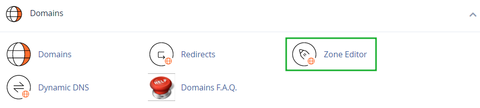
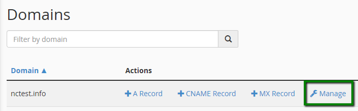
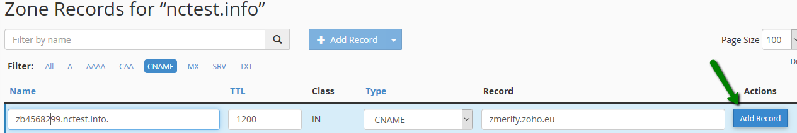
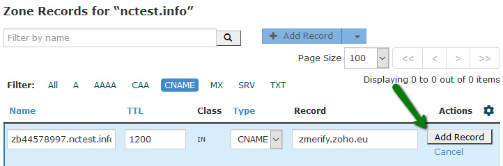
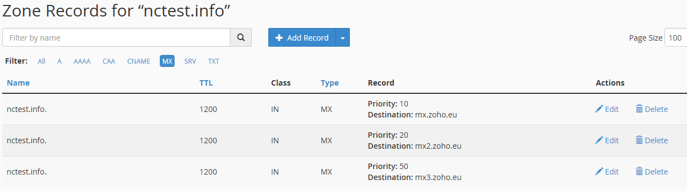
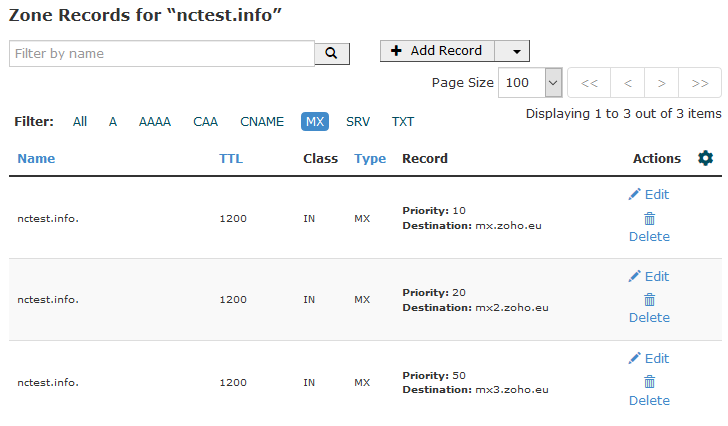
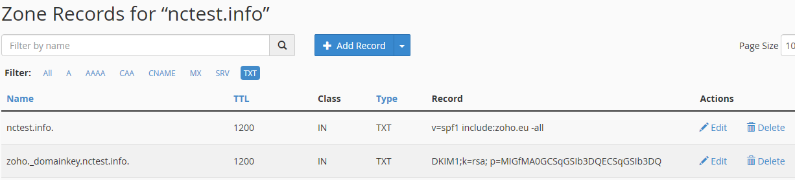
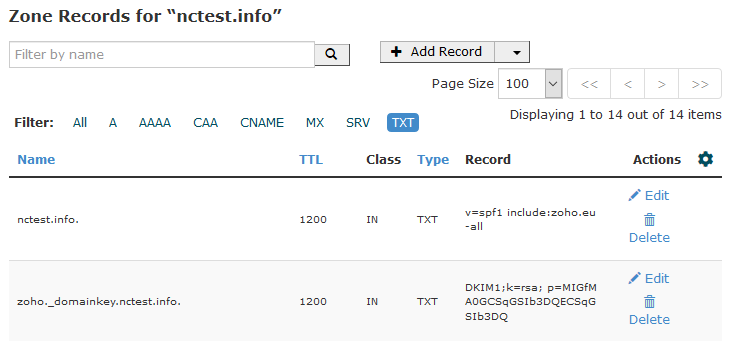
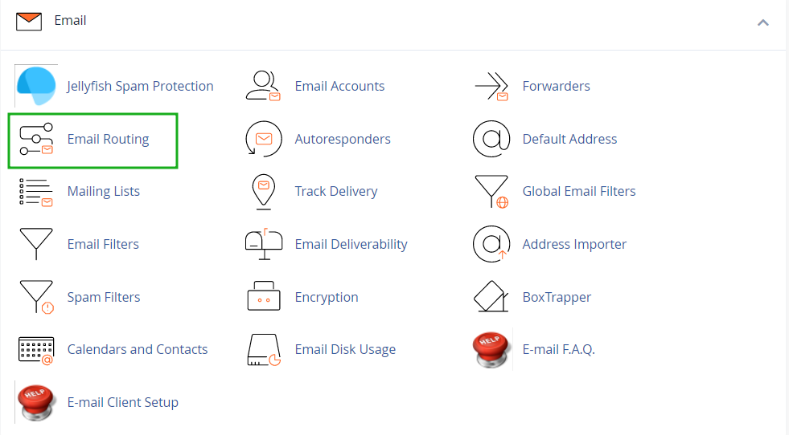
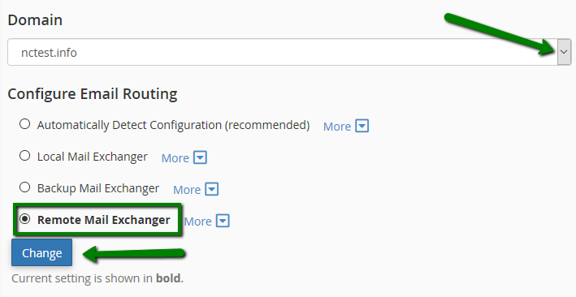

# How to set up Zoho email for a domain hosted with Namecheap

If you would like to link your domain that is hosted with Namecheap to your Zoho email – this article is just for you!

Zoho Mail Suite provides enterprise Email Hosting features, which suit the requirements of organizations of different types and sizes. The entire process is simple, and you can get a custom domain-based email address for all the members of the organization with no downtime.

To set up Zoho mail:

1\. Login to your **cPanel** account and navigate to the **Zone editor** menu:  

Once there click on the **Manage** button next to the domain you want to set up Zoho mail for:

Choose the **Add Record** >> **CNAME** type and paste the code _zb\*\*\*\*\*\*\*\*_ generated in the Zoho Control Panel into the **Name** field. In the **Record** field, enter the value provided by Zoho_, e.g. zmverify.zoho.eu_ and **Add** the record:  

**for cPanel Basic Theme**:

**for cPanel Retro Theme**:

After the domain is verified, it is required to create MX Records for it in order to link the domain to the mail service itself.

In the same Zone editor menu, click on the **Add Record** button and choose **MX** records type.

Add the following records:

**Name**                    **Priority**        **Destination**  
_domain.com         10                 mx.zoho.eu  
domain.com         20                 mx2.zoho.eu  
domain.com         50                 mx3.zoho.eu_

**NOTE**: Based on the datacenter (US/UK/CN), the MX record values will differ for your domain. The correct MX records specific for your domain will be available in [this section](https://mailadmin.zoho.com/cpanel/index.do#orgsettings/config) in Admin Control Panel.  

**for cPanel Basic Theme**:

**for cPanel Retro Theme**:

  

The Changes usually take about 30 minutes to take effect.

**NOTE**: The MX values given above are based on the generic configuration information. For more specific configuration particular for your domain refer to your [Admin Control Panel](https://www.zoho.com/mail/#orgsettings/config).

You may also need to configure the **DKIM** and **SPF** record as well which could be checked in your Zoho Control Panel.

To add these records, choose **TXT** record as the record type, paste your domain name in the **Name** field and enter _v=spf1 include:zoho.eu -all_ into the **Record** field.

Click on the **Add Record** >> **TXT** type once again, enter _zoho.\_domainkey.domain.eu_ into the **Name** field (if zoho was entered as the selector in Zoho Control Panel) and enter the corresponding value of the DKIM record, the one that was copied from the TXT record value field in your Zoho account, into the **Record** field:

**for cPanel Basic Theme**:

**for cPanel Retro Theme**:  

These changes will take effect within 30 minutes.

To complete Zoho mail setup, the **Email Exchanger** should be changed for the domain in question. From within your cPanel account go to the **Email Routing** menu under Email section:  

Select your domain from the drop-down menu, choose **Remote Mail Exchanger** option and click the **Change** button:  

That's it!

## Reference

- https://www.namecheap.com/support/knowledgebase/article.aspx/10150/93/how-to-set-up-zoho-email-for-a-domain-hosted-with-namecheap/
