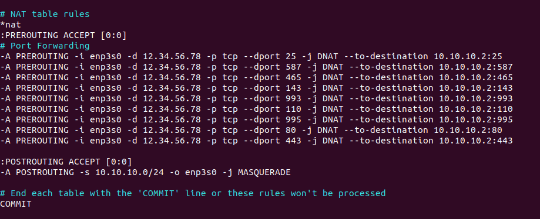

# Set Up Mail Proxy Server on Debian/Ubuntu/CentOS/RockyLinux

This tutorial is going to show you how to set up a mail proxy server.

## When Do You Need Mail Proxy Server?

Some folks run email servers at home, but may have the following problems:

-   **Port 25 is blocked**, so the mail server can’t send emails directly to recipients.
-   **They don’t have a static IP address**, so emails are likely to be rejected or land in the spam folder.
-   **They can’t create PTR record**, so emails are likely to be rejected or land in the spam folder.

If you are in this situation, you can run a **VPS (Virtual Private Server)** at a data center and use it as a proxy for your mail server. The VPS has a static IP address and you can create PTR record for the IP address. Other email servers would think that the VPS runs your mail service and when you send an email, the email then comes from the VPS.


Yes, you can also use SMTP relay services such as [Sendinblue](https://www.linuxbabe.com/tag/sendinblue) to solve these problems, but there’s a limit on how many emails you can send each day and each month. If you upgrade to a paid account with Sendinblue, it costs at least $25 each month. The more emails you send, the higher your monthly cost will be. If you run a VPS and set up mail proxy, it costs about $4 per month no matter how many emails you are going to send.

The mail proxy server is very simple. We just need to set up a VPN tunnel between the mail server and the VPS, then configure port forwarding on the VPS. Previously I also wrote about [setting up SMTP and IMAP proxy with HAProxy](https://www.linuxbabe.com/mail-server/smtp-imap-proxy-with-haproxy-debian-ubuntu-centos). HAProxy allows more flexible settings, but I think it’s too complicated for most users. So I’m writing this mail proxy server guide to make things easy.

## Step 1: Choose the Right VPS for Mail Proxy

You need a VPS that

-   allows you to create PTR record
-   doesn’t block port 25
-   allows you to send unlimited emails without restrictions.

Not all VPS providers meet the above 3 requirements. For example, [DigitalOcean](https://www.linuxbabe.com/digitalocean) blocks port 25 and it would not unblock port 25. Another problem is that big well-known hosting providers like DigitalOcean are abused by spammers. Often the server IP address is on several blacklists.

I run my mail servers on [ScalaHosting](https://www.linuxbabe.com/scalahosting-self-managed-cloud-vps) and [Kamatera VPS](https://www.linuxbabe.com/kamatera). I always recommend them when setting up a mail server. For a mail proxy that doesn’t require much CPU and RAM, you can choose Kamatera VPS. The 1 CPU, 1GB RAM plan costs only $4/month, and you will get one month for free. You can follow the tutorial below to create a Kamatera VPS.

-   [How to Create a Linux VPS Server on Kamatera](https://www.linuxbabe.com/linux-server/how-to-create-a-linux-vps-server-on-kamatera)

You can choose any Linux distro for your VPS, but I recommend you to use Debian, Ubuntu, or RockyLinux/AlmaLinux.

To log into your server, you use an SSH client. If you are using Linux or macOS on your computer, then simply open up a terminal window and run the following command to log into your server. Replace 12.34.56.78 with the IP address of your VPS.

```
ssh root@<span>12.34.56.78</span>
```

You will be asked to enter the password. If you are using Windows, please read the following article on how to use SSH client.

-   [3 Ways to Use SSH on Windows to Log Into Linux Server](https://www.linuxbabe.com/linux-server/ssh-windows)

## Step 2: Set Up VPN Server on Your VPS

You need to set up a VPN server on your VPS, so your VPS will be able to communicate with your mail server without being interrupted due to the change of IP address. The VPN server can also help you bypass port 25 blocking.

You can set up WireGuard VPN on your VPS by following one of the tutorials below. Why do I choose WireGuard instead of other VPN protocols like OpenVPN? Because WireGuard allows you to assign **static private IP addresses** to VPN clients.

-   [Set Up Your Own WireGuard VPN Server on Ubuntu](https://www.linuxbabe.com/ubuntu/wireguard-vpn-server-ubuntu)
-   [Set Up Your Own WireGuard VPN Server on Debian](https://www.linuxbabe.com/debian/wireguard-vpn-server-debian)
-   [Set Up Your Own WireGuard VPN Server on CentOS/Rocky Linux/Alma Linux](https://www.linuxbabe.com/centos/wireguard-vpn-server-centos)

When following the instructions in the above articles, your VPS is the VPN server and your mail server is the VPN client. Please note that you should not enable split tunneling or policy routing on the VPN client.

The VPS will become the default gateway for your mail server and all outbound traffic on your mail server will be tunneled through VPN, so receiving SMTP servers (Gmail, Hotmail, Yahoo Mail, etc) will think your emails come from the VPS.

## Step 3: Open Ports in Firewall

The **VPS** needs to open TCP port 22, 25, 587, 465, 143, 993, 110, 995, 80 and 443 in the firewall. Run the following commands to open these ports.

**Debian/Ubuntu:**

```
sudo apt install ufw 

sudo ufw allow 22,25,587,465,143,993,110,995,80,443/tcp

sudo ufw enable
```

**CentOS/Rocky Linux/Alma Linux**

```
sudo firewall-cmd --permanent --add-service={ssh,smtp,smtp-submission,smtps,imap,imaps,pop3,pop3s,http,https}

sudo systemctl reload firewalld
```

The **mail server** needs to open the above ports, except the SSH port. Run the following command.

**Debian/Ubuntu:**

```
sudo ufw insert 1 allow in from <span>10.10.10.0/24

</span>sudo ufw allow 25,587,465,143,993,110,995,80,443/tcp

sudo systemctl restart ufw
```

**CentOS/Rocky Linux/Alma Linux**

```
sudo firewall-cmd --permanent --add-rich-rule='rule family="ipv4" source address="<span>10.10.10.0/24</span>" accept'

sudo firewall-cmd --permanent --add-service={ssh,smtp,smtp-submission,smtps,imap,imaps,pop3,pop3s,http,https}

sudo systemctl reload firewalld
```

`10.10.10.0/24` is the private IP range created by the VPN server, so the VPS can access all ports on the mail server.

**Hint**: If you use iRedMail’s built-in firewall, you need to disable it with the following command.

```
sudo systemctl disable --now iptables iptables-persistent
```

## Step 4: Set Up Port Forwarding in Firewall on the VPS

Now we need to set up port forwarding on the VPS, so incoming requests will be redirected from the VPS to the mail server. The following ports should be forwarded to the mail server.

-   TCP 25
-   TCP 587
-   TCP 465
-   TCP 143
-   TCP 993
-   TCP 110
-   TCP 995
-   TCP 80
-   TCP 443

Note that the mail server must use the VPN server as the gateway. If it’s using another IP address as the gateway, port forwarding won’t work. So you should not configure split tunneling or policy routing in WireGuard VPN.

**Debian/Ubuntu**

Edit the `/etc/ufw/before.rules` file on the VPS.

```
sudo nano /etc/ufw/before.rules
```

Then add the following lines in the NAT table, above the COMMIT line. This tells UFW to use the **DNAT** target to forward requests to the 10.10.10.2 host in the virtual private network. Replace 12.34.56.78 with your VPS public IP address. 10.10.10.2 is the mail server private IP address.

```
:PREROUTING ACCEPT [0:0]
# Port Forwarding
-A PREROUTING -i <span>enp3s0</span> -d <span>12.34.56.78</span> -p tcp --dport 25 -j DNAT --to-destination <span>10.10.10.2</span>:25
-A PREROUTING -i <span>enp3s0</span> -d <span>12.34.56.78</span> -p tcp --dport 587 -j DNAT --to-destination <span>10.10.10.2</span>:587
-A PREROUTING -i <span>enp3s0</span> -d <span>12.34.56.78</span> -p tcp --dport 465 -j DNAT --to-destination <span>10.10.10.2</span>:465 
-A PREROUTING -i <span>enp3s0</span> -d <span>12.34.56.78</span> -p tcp --dport 143 -j DNAT --to-destination <span>10.10.10.2</span>:143
-A PREROUTING -i <span>enp3s0</span> -d <span>12.34.56.78</span> -p tcp --dport 993 -j DNAT --to-destination <span>10.10.10.2</span>:993 
-A PREROUTING -i <span>enp3s0</span> -d <span>12.34.56.78</span> -p tcp --dport 110 -j DNAT --to-destination <span>10.10.10.2</span>:110
-A PREROUTING -i <span>enp3s0</span> -d <span>12.34.56.78</span> -p tcp --dport 995 -j DNAT --to-destination <span>10.10.10.2</span>:995
-A PREROUTING -i <span>enp3s0</span> -d <span>12.34.56.78</span>  -p tcp --dport 80 -j DNAT --to-destination <span>10.10.10.2</span>:80
-A PREROUTING -i <span>enp3s0</span> -d <span>12.34.56.78</span>  -p tcp --dport 443 -j DNAT --to-destination <span>10.10.10.2</span>:443
```

`enp3s0` is the main network interface on my VPS. Yours might be different. You can run the following command to check.

```
ip addr
```



**Hint**: DNAT (Destination NAT) changes the destination IP address. A typical example is port forwarding. SNAT (Source NAT) changes the source IP address. A typical example is when a host behind a Wifi router wants to browse the Internet.

Flush the NAT table rules.

```
sudo iptables -F -t nat
```

Restart UFW to process all of the NAT rules.

```
sudo systemctl restart ufw
```

Now list all rules in the nat table.

```
sudo iptables -L -t nat
```

Sample output:

```
target     prot opt source               destination         
DNAT       tcp  --  anywhere             12.34.56.78  tcp dpt:smtp to:10.10.10.2:25
DNAT       tcp  --  anywhere             12.34.56.78  tcp dpt:submission to:10.10.10.2:587
DNAT       tcp  --  anywhere             12.34.56.78  tcp dpt:submissions to:10.10.10.2:465
DNAT       tcp  --  anywhere             12.34.56.78  tcp dpt:imap2 to:10.10.10.2:143
DNAT       tcp  --  anywhere             12.34.56.78  tcp dpt:imaps to:10.10.10.2:993
DNAT       tcp  --  anywhere             12.34.56.78  tcp dpt:pop3 to:10.10.10.2:110
DNAT       tcp  --  anywhere             12.34.56.78  tcp dpt:pop3s to:10.10.10.2:995
DNAT       tcp  --  anywhere             12.34.56.78  tcp dpt:http to:10.10.10.2:80
DNAT       tcp  --  anywhere             12.34.56.78  tcp dpt:https to:10.10.10.2:443

Chain INPUT (policy ACCEPT)
target     prot opt source               destination         

Chain OUTPUT (policy ACCEPT)
target     prot opt source               destination         

Chain POSTROUTING (policy ACCEPT)
target     prot opt source               destination         
MASQUERADE  all  --  10.10.10.0/24          anywhere
```

**CentOS/Rocky Linux/Alma Linux  
**

Run the following commands on the VPS. Replace 12.34.56.78 with your VPS public IP address. `10.10.10.2` is the mail server private IP address.

```
sudo firewall-cmd --permanent --direct --add-rule ipv4 nat PREROUTING 0 -i <span>eth0</span> -d <span>12.34.56.78</span> -p tcp --dport 25 -j DNAT --to-destination <span>10.10.10.2</span>:25

sudo firewall-cmd --permanent --direct --add-rule ipv4 nat PREROUTING 0 -i <span>eth0</span> -d <span>12.34.56.78</span> -p tcp --dport 587 -j DNAT --to-destination <span>10.10.10.2</span>:587

sudo firewall-cmd --permanent --direct --add-rule ipv4 nat PREROUTING 0 -i <span>eth0</span> -d <span>12.34.56.78</span> -p tcp --dport 465 -j DNAT --to-destination <span>10.10.10.2</span>:465

sudo firewall-cmd --permanent --direct --add-rule ipv4 nat PREROUTING 0 -i <span>eth0</span> -d <span>12.34.56.78</span> -p tcp --dport 143 -j DNAT --to-destination <span>10.10.10.2</span>:143

sudo firewall-cmd --permanent --direct --add-rule ipv4 nat PREROUTING 0 -i <span>eth0</span> -d <span>12.34.56.78</span> -p tcp --dport 993 -j DNAT --to-destination <span>10.10.10.2</span>:993

sudo firewall-cmd --permanent --direct --add-rule ipv4 nat PREROUTING 0 -i <span>eth0</span> -d <span>12.34.56.78</span> -p tcp --dport 110 -j DNAT --to-destination <span>10.10.10.2</span>:110

sudo firewall-cmd --permanent --direct --add-rule ipv4 nat PREROUTING 0 -i <span>eth0</span> -d <span>12.34.56.78</span> -p tcp --dport 995 -j DNAT --to-destination <span>10.10.10.2</span>:995

sudo firewall-cmd --permanent --direct --add-rule ipv4 nat PREROUTING 0 -i <span>eth0</span> -d <span>12.34.56.78</span> -p tcp --dport 80 -j DNAT --to-destination <span>10.10.10.2</span>:80

sudo firewall-cmd --permanent --direct --add-rule ipv4 nat PREROUTING 0 -i <span>eth0</span> -d <span>12.34.56.78</span> -p tcp --dport 443 -j DNAT --to-destination <span>10.10.10.2</span>:443

sudo systemctl reload firewalld
```

## Step 5: Create DNS Record

**A Record**

The A record of your mail server `mail.example.com` needs to be changed to the VPS public IP address. If your mail server also hosts other web applications like [NextCloud](https://www.linuxbabe.com/ubuntu/install-nextcloud-ubuntu-22-04-nginx-postgresql), make sure all other sub-domains (like `nextcloud.example.com`) be pointed to the VPS public IP address.

**PTR Record**

You should set a **PTR record**, aka reverse DNS record, for your VPS. Kamatera doesn’t allow you to edit PTR record in the control panel. Instead, you need to open a support ticket and tell them to add PTR record for you. It’s not convenient, you might think, but this is to keep spammers away from the platform, so legitimate email senders like us will have a great IP reputation. Tell the support team to update the PTR record of your server IP address to `mail.your-domain.com`.

**Hint**: Kamatera might require you to run a website on their server in order to add the PTR record for you. If you have a website on their infrastructure, then you will be fine. If your website is hosted somewhere else, don’t panic. From my own experience and feedback from many other users, as long as you have a website and it looks legitimate (not a template), they will add the PTR record for you.

They say you need to run a website on their infrastructure because they don’t want to deal with spammers. Actually, if you followed my instructions to the letter, then Kamatera support staff will see that the A record points to the Kamatera VPS, so they will think your website is hosted on their infrastructure. In reality, all traffic is forwarded from the Kamatera VPS to the mail server.

Just tell them what your website URL is and they shall add a PTR record. Don’t provide extra information that’s not requested by them.

-   Don’t say where your website is hosted.
-   Don’t say what domain registrar you are using.
-   Don’t tell them what I tell you.

## Step 6: Test

Now you can test if you can send and receive emails.

## How to Bypass Email Blacklists

Your outgoing emails might be rejected due to IP address blacklisting. Even if you don’t send spam, sometimes your email server IP address can be blacklisted for reasons out of your control. Follow the tutorial below to learn how to get around blacklists.

-   [How to Bypass Email Blacklists](https://www.linuxbabe.com/mail-server/microsoft-outlook-ip-blacklist)

## References

- https://www.linuxbabe.com/mail-server/mail-proxy-server
